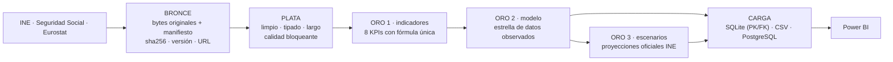

# Riesgo demográfico y sostenibilidad del sistema público de pensiones en España

**Proyecto ETL · Maestría en Ciencia de Datos e Inteligencia Artificial · Universidad Autónoma de Occidente**

Grupo 5: Juan Miguel León Gómez, Mauricio José Mozo Terán, Kevin Fernando Rodríguez Duque y Brandon Eduardo Tobar Sanchez.

Pipeline ETL con **arquitectura Medallion** (Bronce → Plata → Oro) que integra **tres fuentes oficiales** (INE, Seguridad Social y Eurostat) en una base de datos consolidada, validada y trazable, lista para un reporte de Power BI sobre el riesgo demográfico y la sostenibilidad del sistema público de pensiones.

---

## 1. Problema y objetivo

- **El problema.**
  - El sistema de pensiones español es de reparto: las cotizaciones de quienes trabajan pagan las pensiones en curso.
  - Envejecimiento, baja fecundidad (1,10 hijos por mujer en 2024) y mayor longevidad (84,01 años) presionan la relación entre cotizantes y pensionistas y el gasto (13,2 % del PIB en 2024).
  - Los datos para seguir estas variables están dispersos entre varios organismos, con formatos y periodicidades distintos.
- **El objetivo.** Construir una base analítica integrada y reproducible que permita monitorear 8 KPIs de riesgo demográfico y de sostenibilidad y compararlos con los escenarios oficiales de población del INE, dejando la infraestructura lista para Power BI.

## 2. OKRs y KPIs

| OKR | Resultado clave (revisado tras la retroalimentación) | Estado |
| --- | --- | --- |
| O1 · Integración y calidad | KR 1.1: 3 fuentes oficiales automatizadas · KR 1.2: completitud ≥ 95 % · KR 1.3: 100 % del linaje documentado | ✅ 3 fuentes · completitud 100 % · linaje por `run_id` |
| O2 · Indicadores y tablero | KR 2.1: 8 KPIs desde el pipeline · KR 2.2: tablero con 3 pestañas | ✅ 8 KPIs · ✅ tablero Power BI (`powerbi/`) |
| O3 · Uso analítico | KR 3.1: escenarios **oficiales** INE en una capa separada · KR 3.2: informe reproducible | ✅ 8 escenarios INE (2026-2076) · ✅ notebook de 7 partes ejecutado |

| KPI | Indicador | Fórmula | Fuente | Último valor observado |
| --- | --- | --- | --- | --- |
| KPI-01 | Índice de envejecimiento | P65+ / P0-15 × 100 | INE | 148,05 % (2025) |
| KPI-02 | Tasa de dependencia | (P0-15 + P65+) / P16-64 × 100 | INE | 53,17 % (2025) |
| KPI-03 | Dependencia de mayores | P65+ / P16-64 × 100 | INE | 31,73 % (2025) |
| KPI-04 | Indicador coyuntural de fecundidad | publicado por el INE | INE | 1,10 (2024) |
| KPI-05 | Saldo vegetativo | nacimientos − defunciones | INE | −118 113 (2024) |
| KPI-06 | Saldo migratorio exterior | publicado por el INE | INE | +626 268 (2024) |
| KPI-07 | Afiliados en alta por pensión contributiva | afiliados 31/12 / pensiones 1/12 | Seguridad Social | 2,078 (2025) |
| KPI-08 | Gasto en pensiones / PIB | gasto ESSPROS / PIB × 100 | Eurostat | 13,23 % (2024, provisional) |

A estos se suman 5 indicadores de contexto (% de 65+, esperanza de vida al nacer y a los 65 por sexo, tasa de afiliación de 16-64 y pensión media) y 8 métricas base. Todos están en el [diccionario de métricas](docs/05_diccionario_metricas.md) y en la matriz de [trazabilidad OKR → KPI → Oro](docs/04_okr_kpi_trazabilidad.md).

## 3. Fuentes de datos

| Fuente | Acceso | Conjuntos | Cobertura |
| --- | --- | --- | --- |
| **INE** | API JSON Tempus3 | Población por sexo y edad (56934), MNP (6566), migraciones (24309 y 69758), ICF (1407), esperanza de vida (1414 y 1415), proyecciones 2026-2076 (36643 y 36652) | 1971-2025 · 2026-2076 |
| **Seguridad Social** (TGSS e INSS) | XLSX oficiales | Afiliados en alta (último día del mes); pensiones contributivas (número e importe) | 1985-2026 · 2016-2026 |
| **Eurostat** | API JSON-stat 2.0 | PIB (`nama_10_gdp`), gasto en pensiones ESSPROS (`spr_exp_pens`), población de control (`demo_pjan`) | 1990-2025 |

El análisis completo de cada fuente (periodicidad, unidad estadística, identificadores, problemas de calidad, transformaciones y limitaciones) está en [docs/03_fuentes_datos.md](docs/03_fuentes_datos.md), junto con la evaluación del Banco de España y la sustitución de las fuentes periodísticas.

## 4. Arquitectura Medallion y flujo ETL



| Capa | Ruta | Contenido |
| --- | --- | --- |
| Bronce | `data/bronze/{ine,seguridad_social,eurostat}/` | Respuesta original inmutable, con un manifiesto de auditoría por ejecución |
| Plata | `data/silver/` | `stg_poblacion_anual`, `stg_afiliados_mensual`, `stg_pensiones_cuantia`, `stg_pensiones_importe`, `stg_macro_anual` |
| Oro · indicadores | `data/gold/indicadores/` | `kpis_demograficos`, `kpi_ratio_sostenibilidad_anual`, `kpis_integrados_anual` |
| Oro · modelo | `data/gold/modelo/` | 6 dimensiones, `fact_indicadores_anual` y `dm_panel_anual` (**solo datos observados**) |
| Oro · escenarios | `data/gold/escenarios/` | `dim_escenario`, `fact_proyecciones_demograficas` y `dm_escenarios_2050` |
| Carga | `data/serving/` | `pensiones_espana.sqlite`, `csv/`, `postgresql/01_ddl.sql` y `02_carga.sql` |

Diseño detallado, decisiones y alternativas: [docs/02_arquitectura.md](docs/02_arquitectura.md).

## 5. Modelo de datos (Oro)

Hay dos esquemas en estrella con dimensiones conformadas (`dim_tiempo`, `dim_territorio`, `dim_sexo`, `dim_grupo_edad`, `dim_indicador` y `dim_fuente`):

- `fact_indicadores_anual`: datos observados. Grano: año × territorio × sexo × grupo de edad × indicador; 1 563 filas, 1971-2025.
- `fact_proyecciones_demograficas`: escenarios INE. Añade `dim_escenario`; 6 528 filas, 2026-2076.

`dm_panel_anual` es el **conjunto consolidado**: una fila por año con todas las variables. Diagrama, grano y claves: [docs/07_modelo_datos.md](docs/07_modelo_datos.md). Diccionario de datos: [docs/06_diccionario_datos.md](docs/06_diccionario_datos.md).

## 6. Transformaciones principales

- **INE.**
  - Normalización desde los metadatos con mapeos estrictos.
  - Selección del 1 de enero; partición de edades con homologación del tramo abierto.
  - Deduplicación de la respuesta repetida de la tabla 6566.
  - Reconciliación de la ruptura migratoria de 2021.
  - Exclusión del escenario central duplicado.
- **Seguridad Social.**
  - Parsers por encabezado (no por posición).
  - Fechas de fin de mes y de día 1.
  - El corte anual se fecha en diciembre solo si la fuente lo declara.
  - Importe con la misma estructura que el número de pensiones.
- **Eurostat.**
  - Decodificación JSON-stat a formato largo.
  - Flags `p`/`e` a `provisional`.
  - Una sola categoría por dimensión no filtrada.
- **Indicadores.**
  - Grupos de edad 0-15 / 16-64 / 65+.
  - Stocks de diciembre.
  - Cocientes con numerador y denominador guardados.
  - Contraste con el valor publicado.
- **Modelo.**
  - Integración en formato largo con claves deterministas, población por sexo × grupo y panel ancho conciliado.

## 7. Controles de calidad

Hay 111 reglas específicas más la validación de esquema de cada conjunto ([catálogo generado](docs/09_catalogo_reglas_calidad.md)). Cubren:

- tipos, nulos, duplicados, rangos y fechas;
- integridad referencial;
- consistencia entre fuentes (INE frente a Eurostat, calculado frente a publicado, número frente a importe);
- registros inesperados (mapeos estrictos);
- conteo de filas antes y después de cada integración;
- completitud temporal (KR 1.2);
- atípicos (solo advierten).

Una regla fallida bloquea la escritura de la capa, y cada ejecución deja un reporte `*.quality.json`. Resultados de la ejecución real: [docs/10_calidad_y_validacion.md](docs/10_calidad_y_validacion.md).

## 8. Cómo ejecutar

Requisitos: Python 3.11 o superior (probado con 3.14) y acceso a Internet para la etapa Bronce.

```powershell
python -m venv .venv
.\.venv\Scripts\Activate.ps1   
pip install -r requirements.txt
```

```powershell
python main.py                                   # todo: bronce → plata → indicadores → modelo → escenarios → carga (~80 s)
python main.py --desde plata                     # reutiliza el último Bronce íntegro (sin descargar)
python main.py --desde indicadores --hasta modelo
python main.py --desde bronce --hasta plata      # solo ingesta y limpieza
python -m pytest                                 
python -m src.utils.documentacion                
```

`main.py` devuelve 0 si todo termina bien y 1 ante cualquier fallo; en ambos casos escribe el registro en `logs/ejecuciones/`. El detalle técnico va a `logs/etl.log`. Toda la configuración (tablas, filtros, tolerancias, catálogo de indicadores, rutas) está en [`config/config.yaml`](config/config.yaml)

### Ejecución automática (librería `schedule`)

```powershell
python programar.py            # deja el programador activo: por defecto, todo el pipeline cada lunes a las 06:00
python programar.py --ahora    # además, ejecuta una vez al arrancar
python programar.py --una-vez  # una ejecución y termina
```

La frecuencia (`diaria`, `semanal`, `cada_minutos`, `cada_segundos`), el día, la hora y el tramo de etapas están en `config.yaml › programacion`. `src/programacion.py` (`ProgramadorETL`) registra cada ejecución en `logs/programacion.jsonl` y aísla los fallos: un error se registra y se reintenta en la siguiente ejecución sin detener el programador. `schedule` vive dentro del proceso de Python, por lo que `programar.py` debe seguir abierto.

## 8.1 Notebook step by step

[`notebooks/Proyecto_ETL_Pensiones_Espana.ipynb`](notebooks/Proyecto_ETL_Pensiones_Espana.ipynb) explica todo el pipeline paso a paso, ya ejecutado, en siete partes:

| Parte | Contenido |
| --- | --- |
| 1 · Extracción | Para el INE, la Seguridad Social y Eurostat: librerías, creación y prueba de la conexión, extracción, almacenamiento en Bronce (manifiesto y sha256), comprobación con `.shape`, `.columns`, `.head()` y una muestra aleatoria de 5 registros, y cierre de la conexión |
| 2 · Comprensión inicial | Registros, variables, tipos, no nulos, rol de cada variable (identificador, categórica, numérica, fecha) y rango de fechas de cada dataset original |
| 3 · Perfil de calidad | Nulos (cantidad, %, normales frente a problemáticos), únicos y cardinalidad, duplicados exactos y semánticos, y revisión de tipos; sin eliminar ni imputar |
| 4 · Estadísticos descriptivos | Numéricos (count, media, desviación, mínimo, p25, mediana, p75, máximo) y categóricos (únicos, categorías, frecuencias, moda) por fuente |
| 5 · Preguntas de negocio | 15 preguntas resueltas con pandas sobre los datos originales, ligadas a los OKRs y KPIs, con conclusiones sobre el reto demográfico |
| 6 · Transformación Medallion | Bronce → Plata → Oro: estrategia de nulos por variable, duplicados, estandarización de categorías, reconciliación exacta de filas, tipos, calidad, modelo, carga y linaje |
| 7 · Automatización | Programación del pipeline con `schedule` y demostración de una ejecución programada |

Los DataFrames originales salen de `src/eda/bronce_a_dataframe.py`, que aplana los archivos de Bronce sin limpiarlos. Para regenerar el notebook:

```powershell
pip install -r requirements-dev.txt
python notebooks/generar_notebook_proyecto.py --ejecutar            # descarga en vivo las tres fuentes
python notebooks/generar_notebook_proyecto.py --ejecutar --sin-red  # reutiliza el último Bronce completado
```

## 8.2 Tablero de Power BI

[`powerbi/Pensiones_Espana.pbip`](powerbi/) es un proyecto de Power BI con 5 páginas: Demografía, Cotización y pensiones, Sostenibilidad financiera, Resumen de KPIs y Calidad del dato. Se genera desde la capa Oro con `python powerbi/generar_tablero.py --validar`.

## 9. Dependencias

`pandas` y `pyarrow` (tablas y Parquet), `requests` (APIs), `openpyxl` (XLSX), `PyYAML` (configuración), `rich` (consola), `schedule` (ejecución programada), `pytest` (pruebas) y `matplotlib` (notebook). SQLite viene con Python. Las versiones exactas están en [`requirements.txt`](requirements.txt); las del notebook, en `requirements-dev.txt`.

## 10. Resultado final (ejecución del 29/09/2026)

| Artefacto | Resultado |
| --- | --- |
| Pipeline completo desde Bronce | ✅ 13 pasos, 80 s, 0 fallas de calidad |
| Base consolidada `data/serving/pensiones_espana.sqlite` | 14 tablas (PK/FK verificadas) + 3 vistas |
| Hechos observados / proyectados | 1 563 / 6 528 filas |
| Completitud temporal (KR 1.2) | 100 % en las 36 series observadas |
| Consistencia entre fuentes | Población INE frente a Eurostat ≤ 0,0002 %; gasto/PIB frente al publicado ≤ 0,005 pp |
| Pruebas | 292 en verde (01/10/2026, con la automatización y el EDA de datos originales) |

## 11. Limitaciones

- El KPI-07 mide afiliados por pensión: la fuente automatizable no publica pensionistas.
- Pensiones solo desde 2016.
- Ruptura del saldo migratorio en 2021.
- Últimos años de PIB y gasto provisionales.
- Solo ámbito nacional.
- Los escenarios son demográficos, no fiscales.
- Los scripts de PostgreSQL no se ejecutaron contra un servidor.

Detalle y tratamiento en [docs/12_limitaciones_y_proximos_pasos.md](docs/12_limitaciones_y_proximos_pasos.md).

## 12. Documentación

| Documento | Contenido |
| --- | --- |
| [00 · Matriz de cumplimiento de la retroalimentación](docs/00_matriz_cumplimiento_retroalimentacion.md) | Cada comentario → cambio → archivo → verificación |
| [01 · Diagnóstico](docs/01_diagnostico.md) | Estado de partida, problemas, inconsistencias y brechas |
| [02 · Arquitectura](docs/02_arquitectura.md) | Medallion, flujo ETL, estructura y decisiones |
| [03 · Fuentes de datos](docs/03_fuentes_datos.md) | Análisis por fuente, relaciones, Banco de España, fuentes periodísticas |
| [04 · OKR, KPI y trazabilidad](docs/04_okr_kpi_trazabilidad.md) | Ficha de cada KPI, matriz de trazabilidad, preguntas reformuladas |
| [05 · Diccionario de métricas](docs/05_diccionario_metricas.md) *(generado)* | Fórmula, frecuencia, unidad, fuente y agregación |
| [06 · Diccionario de datos](docs/06_diccionario_datos.md) *(generado)* | Todas las tablas y columnas |
| [07 · Modelo de datos](docs/07_modelo_datos.md) | Diagrama ER, grano, claves y decisiones |
| [08 · Linaje](docs/08_linaje_datos.md) | Linaje por conjunto, por KPI y ejemplo inverso |
| [09 · Catálogo de reglas de calidad](docs/09_catalogo_reglas_calidad.md) | Las 111 reglas por capa |
| [10 · Calidad y validación](docs/10_calidad_y_validacion.md) | Estrategia y resultados de la ejecución real |
| [11 · Guía de Power BI](docs/11_guia_power_bi.md) | Conexión, relaciones, DAX y pestañas |
| [12 · Limitaciones y próximos pasos](docs/12_limitaciones_y_proximos_pasos.md) | |
| [Anexos](docs/anexos/) | Decisiones detalladas de Plata INE y Seguridad Social
