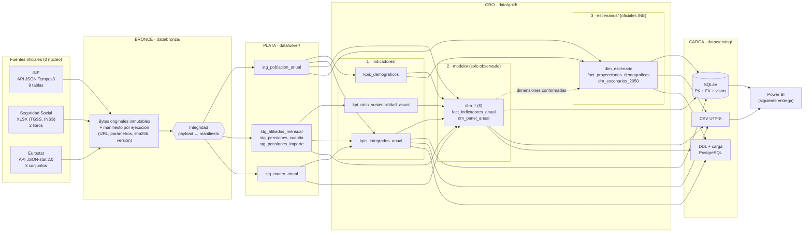

# 2. Arquitectura Medallion y flujo ETL (Fase 2)

## 2.1 Diagrama de arquitectura



## 2.2 Responsabilidad de cada capa

| Capa | Qué contiene | Qué **no** hace | Módulos |
| --- | --- | --- | --- |
| **Bronce** | Respuesta original de cada fuente, byte a byte (JSON del INE y de Eurostat, XLSX de la Seguridad Social), con un manifiesto por ejecución: `run_id`, estado, URL final, parámetros, código HTTP, tamaño, sha256, fecha UTC de descarga, **versión de la fuente** (`updated` de Eurostat) y validaciones mínimas (JSON válido, hojas presentes, metadatos presentes). | No corrige, no filtra filas, no deduplica ni cambia tipos. Una respuesta vacía, de error o con otro formato **no se guarda**. | `src/extract/` |
| **Plata** | Datos limpios en formato largo, tipados (`Int64`, `float64`, `date32`, `string`), con nombres de columna homogéneos (`snake_case`), unidades explícitas, estados del dato (`observado`, `provisional`, `proyectado`), duplicados de la fuente eliminados de forma justificada y reconciliaciones documentadas. Cada conjunto pasa sus reglas de calidad antes de escribirse. | **No calcula KPIs** (cambio respecto al avance anterior), no imputa ni interpola. | `src/transform/` |
| **Oro · indicadores** | Cálculo de los KPIs con fórmula única: los KPIs demográficos (observados y proyectados), el ratio de pensiones y los KPIs que cruzan fuentes (gasto/PIB y tasa de afiliación), guardando numerador y denominador. | No integra ni modela. | `src/indicators/` |
| **Oro · modelo** | Modelo dimensional en estrella de **datos observados**: 6 dimensiones conformadas, la tabla de hechos en formato largo y el panel ancho consolidado. | No recalcula KPIs, que toma de la capa de indicadores; solo agrega la población por grupo de edad y sexo con la misma clasificación. No contiene proyecciones. | `src/model/` |
| **Oro · escenarios** | Proyecciones **oficiales** del INE (8 escenarios, 2026-2076) sobre las mismas dimensiones que el modelo, más un *data mart* 2030-2050 base/optimista/pesimista. | No proyecta empleo, cotizaciones, PIB ni gasto: no es modelación propia. | `src/scenarios/` |
| **Carga** | Publicación para consumo: SQLite con PK, FK y vistas (verificada), CSV UTF-8 con BOM, DDL y carga para PostgreSQL, y tablas auxiliares de linaje y calidad. | No transforma. | `src/serving/` |

## 2.3 Flujo ETL y orquestación

`main.py` ejecuta 13 pasos agrupados en 6 etapas. `--desde` y `--hasta` permiten reejecutar cualquier tramo sin volver a descargar:

```text
bronce       bronce_ine · bronce_seguridad_social · bronce_eurostat
plata        integridad_bronce · plata_ine · plata_seguridad_social · plata_eurostat
indicadores  indicadores_demografia · indicadores_pensiones · indicadores_integrados
modelo       modelo
escenarios   escenarios
carga        carga
```

- **Reproducible.** Toda la parametrización está en `config/config.yaml`, las claves sustitutas son deterministas y cada capa lee solo el **último manifiesto completado** de la anterior y verifica su sha256 (`SilverReader`). Con los mismos Bronces se obtienen los mismos Oros; la prueba `test_dimension_keys_are_deterministic_across_runs` lo comprueba.
- **Idempotente y atómico.**
  - Los Parquet se escriben en un temporal y se sustituyen con `os.replace`; la base SQLite se reconstruye en un temporal y también se sustituye.
  - Bronce nunca sobrescribe: cada descarga tiene una marca de tiempo propia.
- **Trazable.**
  - Cada fila de Oro guarda `dataset_origen`, `run_id_origen` y `gold_run_id`.
  - Cada manifiesto enlaza sus entradas (`run_id`, sha256).
  - El registro `logs/ejecuciones/pipeline_{UTC}.json` enlaza el `run_id` de cada paso y se escribe también cuando la ejecución falla.
- **Validable.**
  - Cada paso escribe `{run_id}.quality.json` con cada regla evaluada y el motivo del rechazo.
  - Una regla en `falla` bloquea la escritura; las advertencias no bloquean.
- **Linaje coherente.** El modelo se detiene si los indicadores proceden de otra ejecución de Plata distinta de la que lee (`MOD-00 linaje_coherente`). Evita mezclar versiones de los datos.
- **Conexiones cerradas.** Cada extractor abre una `requests.Session` y se usa como gestor de contexto (`with IneExtractor(config) as extractor:`), de modo que la conexión se cierra también cuando la descarga falla; una conexión cerrada rechaza nuevas peticiones.
- **Automatizable.** `programar.py` ejecuta el pipeline con la librería `schedule` según `config.yaml › programacion` (por defecto, cada lunes a las 06:00). `ProgramadorETL` registra cada ejecución en `logs/programacion.jsonl` y un fallo no detiene el programador.

## 2.4 Estructura del repositorio

```text
Proyecto_Final_ETL-main/
├── main.py                         # CLI: --desde / --hasta / --config
├── programar.py                    # ejecución automática con schedule (--ahora / --una-vez)
├── config/config.yaml              # fuentes, tolerancias, catálogo de indicadores, rutas
├── src/
│   ├── pipeline.py                 # orquestación: 13 pasos, registro de ejecución
│   ├── programacion.py             # ProgramadorETL: frecuencia, registro y aislamiento de fallos
│   ├── logger.py                   # consola por bloques + logs/etl.log
│   ├── extract/                    # BRONCE
│   │   ├── http_client.py · bronze_storage.py · bronze_integrity.py
│   │   ├── ine/  seguridad_social/  eurostat/
│   ├── transform/                  # PLATA
│   │   ├── demografia_transform.py · poblacion_consolidator.py · age_partition.py
│   │   ├── ine/  seguridad_social/  eurostat/
│   ├── indicators/                 # ORO 1 · capa de indicadores
│   │   ├── demografia_kpis.py · demografia_indicadores.py · kpi_schema.py
│   │   ├── kpi_ratio.py · pensiones_indicadores.py · kpi_ratio_schema.py
│   │   └── integrados.py · integrados_indicadores.py · integrados_schema.py
│   ├── model/                      # ORO 2 · modelo dimensional (observado)
│   │   ├── dimensiones.py · hechos.py · panel.py · modelo_schema.py · modelo_gold.py
│   ├── scenarios/                  # ORO 3 · escenarios oficiales
│   │   ├── proyecciones.py · escenarios_schema.py · escenarios_gold.py
│   ├── serving/                    # CARGA
│   │   ├── esquema_relacional.py (contrato PK/FK/vistas) · carga.py
│   ├── quality/                    # reglas por capa + reporte + comprobaciones comunes
│   ├── eda/                        # Bronce → DataFrames originales sin limpiar (solo para el notebook)
│   └── utils/                      # manifiestos, escritura, esquemas, lector verificado, documentación
├── tests/                          # espejo de src/ + dobles deterministas (sin red)
├── notebooks/                      # Proyecto_ETL_Pensiones_Espana.ipynb: 7 partes (extracción → EDA → calidad → preguntas → Medallion → schedule)
├── docs/                           # 00-12 + anexos (ver README)
└── data/ · logs/                   # generados (no versionados)
```

**Cambios frente a la estructura anterior:**

- `src/load/` desaparece y queda dividido en `indicators/`, `model/`, `scenarios/` y `serving/`.
- `silver_reader.py` pasa a `utils/`, porque lo usan todas las capas.
- Se eliminan los módulos vacíos.
- Se sustituye `sostenibilidad_*`, que mezclaba modelo y escenarios.

## 2.5 Decisiones de diseño justificadas

| Decisión | Alternativas | Justificación |
| --- | --- | --- |
| **Eurostat como tercera fuente** (no Banco de España) | BdE (PIB), AIReF (proyecciones), COFOG `gov_10a_exp` (función vejez) | Gasto y PIB en el mismo marco SEC 2010/ESSPROS, con API programática y porcentaje publicado para contrastar. La función «vejez» de COFOG no incluye supervivencia ni invalidez, por lo que no mide el «gasto en pensiones» del KPI. |
| **KPIs publicados no se recalculan** (ICF, esperanza de vida) | Calcularlos desde nacimientos y población por edad | Exigen tasas específicas por edad de la madre y tablas de vida que el INE ya publica con su metodología oficial. Recalcularlos introduciría error y dejaría de ser un dato oficial. |
| **Tabla de hechos larga** (un indicador por fila) | Tabla ancha | Las coberturas son muy distintas (1971-2025, 1985-, 1995-, 2016-): una tabla ancha estaría llena de nulos indistinguibles de fallos. La tabla larga admite indicadores nuevos sin cambiar el esquema. La vista ancha existe aparte (`dm_panel_anual`) para el consumo. |
| **`dim_indicador` y `dim_fuente` explícitas** | Catálogo solo en YAML (diseño anterior) | Power BI necesita nombre, unidad, fórmula y pestaña como atributos filtrables. Además, el diccionario de métricas y la dimensión salen del mismo catálogo. |
| **Modelo solo observado + escenarios aparte con dimensiones conformadas** | Una tabla con `escenario_key` | Responde a R3. En Power BI, observado y proyectado se combinan por `dim_tiempo` y `dim_indicador` sin mezclarse físicamente. |
| **SQLite + scripts PostgreSQL** | Carga directa en PostgreSQL | SQLite no necesita servidor, se verifica en cada ejecución y cualquier revisor puede abrirla. Los scripts de PostgreSQL salen del mismo contrato para una instalación con servidor. |
| **Advertencia, no falla, en atípicos y consistencia entre fuentes** | Bloquear | En series oficiales, un salto suele ser real (COVID-2020, crisis 2008-2014, ruptura migratoria de 2021). Se registra para revisión humana sin corregir datos. |
