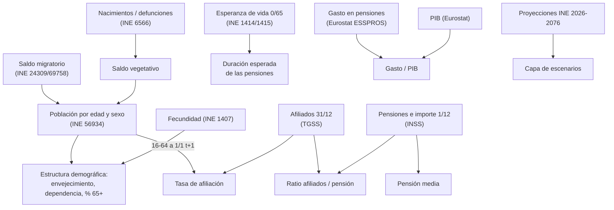

# 3. Fuentes de datos

El MVP integra **3 fuentes oficiales núcleo**. La tabla resume la cobertura real obtenida en la ejecución del 29/09/2026; las fichas de cada fuente van a continuación.

| Fuente | Organismo | Acceso | Conjuntos | Cobertura usada | Aporta a |
| --- | --- | --- | --- | --- | --- |
| INE | Instituto Nacional de Estadística | API JSON Tempus3 (`servicios.ine.es/wstempus/js`), `tip=M` (con metadatos) | Tablas 56934, 6566, 24309, 69758, 1407, 1414, 1415, 36643 y 36652 | 1971-2025 observado; 2026-2076 proyectado | KPI-01 a KPI-06, población, esperanza de vida y escenarios |
| Seguridad Social | Ministerio de Inclusión, Seguridad Social y Migraciones (TGSS e INSS) | Descarga de XLSX del portal estadístico | Serie de afiliados en alta (último día del mes); avance mensual de pensiones contributivas (número e importe) | Afiliados 1985-01 a 2026-08; pensiones anuales a diciembre 2016-2025 y mensuales 2025-01 a 2026-09 | KPI-07, pensión media y tasa de afiliación |
| Eurostat | Oficina Estadística de la UE | API de difusión JSON-stat 2.0 | `nama_10_gdp`, `spr_exp_pens` y `demo_pjan` | PIB 1995-2025 (2023-2025 provisional); gasto 1990-2024; población 1960-2025 | KPI-08 y control de consistencia de la población |

La **unidad de análisis común** es el **año × territorio (España, `ES`)**. Las claves de integración son `anyo` y `territorio`, más `sexo` y el grupo de edad cuando la fuente los publica. Cada fuente tiene una referencia temporal distinta, que se conserva en `fecha_referencia` y en el catálogo (`referencia_temporal`):

- 1 de enero para los stocks de población;
- 31 de diciembre para la afiliación;
- 1 de diciembre para las pensiones;
- año natural para los flujos.

## 3.1 INE

| Tabla | Operación | Qué aporta | Periodicidad y referencia | Población / unidad | Variables usadas | Problemas de calidad detectados | Transformación en Plata |
| --- | --- | --- | --- | --- | --- | --- | --- |
| 56934 | Estadística Continua de Población | Población por sexo y edad simple | Trimestral; se usa el 1 de enero | Residentes; personas | Sexo, edad simple 0-104 y tramo abierto 105+ (85+ y 100+ en periodos antiguos) | El tramo abierto cambia según el periodo. La suma de sexos difiere del total en ±1 persona por edad antes de 2013 (redondeo); el máximo observado es 12 personas en un año. | Selección del 1 de enero; partición de edades con el tramo vigente homologado a «100 y más»; filas de control para cuadrar con «Todas las edades» (tolerancia de 16 personas antes de 07/2012). |
| 6566 | Movimiento Natural de la Población | Nacimientos y defunciones | Anual | Eventos de residentes | Concepto demográfico | **La API devuelve cada serie 3 veces** y en orden variable, así que el sha256 cambia entre descargas. | Deduplicación de copias idénticas documentada (`duplicate_series_response`). |
| 24309 | Estadística de Migraciones | Saldo migratorio con el extranjero | Anual (hasta 2020) | Movimientos migratorios | Saldo con el extranjero | Se solapa en 2021 con la tabla 69758 y usa otra unidad. | Se usa hasta 2020 (regla `reconciliation.migration_overlap`). |
| 69758 | Estadística de Migraciones y Cambios de Residencia | Saldo exterior | Anual (desde 2021) | Migraciones | Tipo de saldo = exterior | **Ruptura de serie** frente a 24309. | Fuente canónica desde 2021; la unidad se conserva por fila y no se homogeneiza. |
| 1407 | Indicadores Demográficos Básicos | **ICF (KPI-04)** | Anual, 1975-2024 | Hijos por mujer | Nacionalidad = ambas; orden = todos | Ninguno detectado. | Mapeo estricto de las variables constantes (una categoría no esperada detiene Plata). |
| 1414 · 1415 | Indicadores Demográficos Básicos | Esperanza de vida a los 0 y a los 65 años | Anual, 1975-2024 | Años | Sexo (total, hombres y mujeres) | La edad (0 o 65) llega como variable «edad simple». | Se declara como constante de la tabla, no como dimensión; la métrica identifica la edad. |
| 36643 · 36652 | Proyecciones de Población 2026-2076 | Población proyectada por sexo y edad, escenario central + 7 alternativos | Anual (1 de enero), 2026-2076 | Personas | Escenario, sexo, edad 0-99 y 100+ | 36652 repite el escenario Central de 36643. | Se excluye el Central de 36652; los escenarios se normalizan a `snake_case`. |

**Limitaciones metodológicas del INE:**

- Las series de población son estimaciones que se revisan con cada censo.
- Las proyecciones son **escenarios condicionales**, no predicciones.
- El saldo migratorio de 2008-2020 y el de 2021-2024 **no son comparables sin reservas**.

## 3.2 Seguridad Social

| Conjunto | Publicador | Qué aporta | Periodicidad y referencia | Unidad estadística | Problemas de calidad | Transformación |
| --- | --- | --- | --- | --- | --- | --- |
| Serie de afiliados en alta por regímenes (último día del mes) | TGSS | Afiliados en alta, TOTAL SISTEMA | Mensual, último día del mes, 1985-01 a 2026-08 | Situaciones de alta (una persona con dos empleos cuenta dos veces) | Libro Excel con encabezados de varias filas; etiquetas del tipo «Enero 2016». | Parser por encabezado (no por posición): mes y año a fecha fin de mes; completitud mensual ≥ 95 %; fechas no futuras. |
| Avance mensual de pensiones contributivas (hojas «Nº Pens. Clases» e «Importe €») | INSS | Número de pensiones y **importe de la nómina** por clase (IP, jubilación, viudedad, orfandad y favor familiar) | Anual a diciembre (2016-2025) y mensual reciente (2025-01 a 2026-09); pensiones en vigor el día 1 | **Pensiones** (no pensionistas); miles de euros | Los datos anuales corresponden a diciembre solo si aparece la nota «Datos anuales a diciembre»; hay meses futuros vacíos; hay una sección «% variación» al final. | Se exige la nota para fechar el anual en diciembre; los meses vacíos se registran como no publicados; las clases deben sumar el total (importe con tolerancia de 0,01 miles de €) y el importe debe cubrir los mismos periodos que el número. |

**Limitaciones de la Seguridad Social:**

- **No publica en estos libros el número de pensionistas.** El ratio es «afiliados por pensión»: 2,078 en diciembre de 2025, frente al 2,37 «por pensionista» que cita el documento para junio de 2026.
- La serie anual de pensiones empieza en 2016.
- Las **URL cambian cada mes**, así que hay que actualizarlas en `config.yaml › sources.seguridad_social.files`.
- El importe de la nómina es mensual: **no equivale al gasto anual**, que incluye pagas extraordinarias.

## 3.3 Eurostat

| Conjunto | Qué aporta | Periodicidad | Unidad | Filtros | Problemas de calidad | Transformación |
| --- | --- | --- | --- | --- | --- | --- |
| `nama_10_gdp` | PIB a precios corrientes (B1GQ) | Anual, 1995-2025 | Millones de € | geo = ES, unit = CP_MEUR | Los años 2023-2025 llevan el flag **`p` (provisional)**. | El flag se conserva y se mapea a `estado_dato = provisional`. |
| `spr_exp_pens` | Gasto total en pensiones (ESSPROS) y su % del PIB publicado | Anual, 1990-2024 | Millones de € y % del PIB | spdepb = TOTAL, spdepm = TOTAL | El % publicado está redondeado a 2 decimales. | Se guardan ambos; el % publicado solo se usa como **control** del cálculo. |
| `demo_pjan` | Población a 1 de enero | Anual, 1960-2025 | Personas | age = TOTAL, sex = T | Eurostat la recibe del INE. | Solo sirve de **control de consistencia** con el INE (diferencia máxima 0,0002 %). |

**Reglas generales de la normalización JSON-stat:**

- Las dimensiones no filtradas deben tener una única categoría.
- Todo flag debe estar documentado en `status_flags`.
- Todo territorio y toda unidad deben estar mapeados.
- Si algo no se cumple, Plata se detiene.

**Limitaciones de Eurostat:**

- El gasto ESSPROS incluye pensiones contributivas, no contributivas y de clases pasivas, así que es más amplio que la nómina del INSS.
- Los últimos años se revisan.

## 3.4 Relación entre las fuentes

Variables que se consideraron y no se incluyen en el MVP, con su motivo:

- **Tasa de empleo o paro (EPA):** la afiliación ya mide la base contributiva.
- **Ingresos por cotizaciones:** no hay serie oficial automatizable y homogénea con el gasto.
- **IPC y revalorización:** no forman parte de ningún KPI del proyecto.
- **Comunidades autónomas:** fuera del alcance del MVP (R1); `dim_territorio` está preparada para añadirlas.

## 3.5 Banco de España: evaluado y no incorporado al MVP

Se evalua la API del Banco de España. Se evaluó (`app.bde.es/bierest`, que responde correctamente) y se decidió no usarla en el MVP por tres razones:

1. **El dato necesario no está.** El KPI-08 exige el gasto en pensiones, y el BdE no publica en su API la serie ESSPROS de gasto en pensiones.
2. **El PIB del BdE es el del INE.** La Contabilidad Nacional la elabora el INE, así que usar el BdE solo para el PIB añadiría una fuente sin información nueva y obligaría a combinar numerador y denominador de dos productores distintos.
3. **Eurostat resuelve ambos en un marco coherente.** Publica gasto y PIB en el mismo marco SEC 2010/ESSPROS y el % del PIB calculado por la propia Eurostat, lo que permite verificar el KPI (diferencia máxima de 0,0050 pp).

Queda como extensión para variables que el MVP no usa, como el IPC o la deuda pública (ver [12](12_limitaciones_y_proximos_pasos.md)).

## 3.6 Sustitución de fuentes periodísticas por series oficiales

| Cifra del Avance 1 | Fuente original | Serie oficial en el pipeline | Valor oficial (ejecución 29/09/2026) | Estado |
| --- | --- | --- | --- | --- |
| Índice de envejecimiento 2025 = 148 % | Fundación Adecco (nota de prensa) | INE 56934 → `indice_envejecimiento` | **148,05 %** (1/1/2025) | ✅ Sustituida y verificada |
| ICF 2024 = 1,10 | INE (nota de prensa) | INE 1407 → `indicador_coyuntural_fecundidad` | **1,10** | ✅ Serie oficial |
| Esperanza de vida 2024 = 84,01 (81,38 H / 86,53 M) | INE (nota de prensa) | INE 1414 → `esperanza_vida_nacimiento` | **84,01 / 81,38 / 86,53** | ✅ Serie oficial |
| Población de 65+ = 20,4 % | INE | INE 56934 → `porcentaje_mayores_65` | 20,42 % (2024); 20,72 % (2025) | ✅ |
| Ratio 2,37 cotizantes/pensionista (junio de 2026) | La Moncloa / EFE | TGSS + INSS → `ratio_cotizantes_pensionistas` | 2,078 afiliados **por pensión** (diciembre de 2025) | ⚠ Otro denominador: la fuente automatizable no publica pensionistas |
| Mínimo del ratio de 1,93 en 2014 | Infobae | — | Serie anual disponible desde 2016 | ❌ No verificable; se retira como dato |
| 5,3 M de jubilaciones frente a 1,8 M de entradas (2025-2035) | Fundación Adecco | — | Es una proyección de mercado laboral, fuera del alcance (R3/R4) | ❌ Se retira como dato del pipeline |
| Gasto de 17,3 % del PIB en 2050 | Comisión Europea (Ageing Report) | — | Proyección oficial fiscal; no se integra en el MVP | ➖ Se cita como contexto, no como dato del pipeline |
