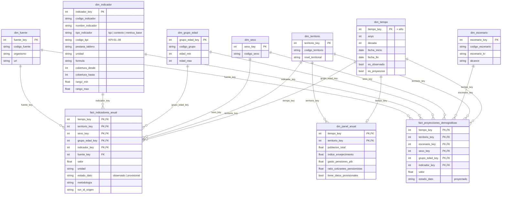

# 7. Modelo de datos de la capa Oro

La capa Oro se diseñó a partir de las preguntas de negocio y de los OKR, no como réplica de las tablas de origen. Tiene dos esquemas en estrella que **comparten dimensiones conformadas**:

- el modelo de datos **observados** (`data/gold/modelo/`);
- la capa de **escenarios oficiales** (`data/gold/escenarios/`).

Encima de ambos se publican tablas de consumo directo (`dm_*`). La definición de cada columna está en [06_diccionario_datos.md](06_diccionario_datos.md).

## 7.1 Diagrama del modelo

## 7.2 Tablas, grano y claves

| Tabla | Tipo | Grano | Clave primaria | Claves foráneas | Filas (29/09/2026) |
| --- | --- | --- | --- | --- | --- |
| `dim_tiempo` | Dimensión | 1 año (1971-2076, sin huecos) | `tiempo_key` | — | 106 |
| `dim_territorio` | Dimensión | 1 territorio | `territorio_key` | — | 1 (ES) |
| `dim_sexo` | Dimensión | total, hombres, mujeres | `sexo_key` | — | 3 |
| `dim_grupo_edad` | Dimensión | total, 0-15, 16-64, 65+ | `grupo_edad_key` | — | 4 |
| `dim_fuente` | Dimensión | organismo | `fuente_key` | — | 4 |
| `dim_indicador` | Dimensión (diccionario de métricas) | indicador | `indicador_key` | — | 21 (8 KPI + 5 contexto + 8 base) |
| `fact_indicadores_anual` | Hechos (observado) | año × territorio × sexo × grupo de edad × indicador | 5 claves | 6 dimensiones | 1 563 |
| `dm_panel_anual` | *Mart* ancho | año × territorio (sexo total) | `tiempo_key`, `territorio_key` | tiempo, territorio | 55 (1971-2025) |
| `dim_escenario` | Dimensión | escenario INE | `escenario_key` | — | 8 |
| `fact_proyecciones_demograficas` | Hechos (proyectado) | año × territorio × escenario × sexo × grupo de edad × indicador | 6 claves | 7 dimensiones | 6 528 |
| `dm_escenarios_2050` | *Mart* | año × escenario KR × grupo de edad × indicador (2030-2050) | 5 columnas naturales | — (desnormalizado) | 504 |
| `aux_kpis_integrados` | Auxiliar de auditoría | año × indicador | `anyo`, `territorio`, `indicador` | — | 70 |
| `aux_linaje`, `aux_calidad_reglas` | Auxiliares de gobierno del dato | conjunto / regla | ver diccionario | — | 12 / 126 |

## 7.3 Decisiones de modelado

- **Granularidad consistente.** Las dos tablas de hechos son **anuales**. Los datos mensuales (afiliados, pensiones) se llevan a stock de diciembre en la capa de indicadores, con la metodología en `metodologia`. Nunca se mezclan frecuencias en una misma tabla.
- **Una fila por indicador (formato largo).**
  - Cada indicador tiene la cobertura que publica su fuente y no hay filas vacías artificiales.
  - La unidad y la metodología viajan con la fila. El saldo migratorio, por ejemplo, cambia de unidad en 2021.
  - Añadir un indicador no cambia el esquema.
- **Desagregaciones declaradas.** El catálogo declara por qué dimensiones se desagrega cada indicador:
  - población: sexo × grupo de edad;
  - esperanza de vida: sexo;
  - resto: solo total.
  
  La regla `MOD-12` impide filas con desagregaciones no declaradas. Así, en Power BI, **filtrar `sexo = total` y `grupo = total` devuelve exactamente una fila por indicador y año**.
- **Sin dobles conteos.** La población solo se suma por grupo de edad sobre las edades de detalle (`es_control = False`). Los totales se validan, pero no se suman. Las reglas `MOD-14` y `MOD-15` comprueban que los grupos suman el total y que hombres + mujeres suman el total, con la tolerancia de redondeo del INE.
- **Claves sustitutas deterministas.**
  - `tiempo_key` es el año.
  - Las demás claves salen del catálogo de configuración.
  - Las relaciones de Power BI se mantienen entre ejecuciones.
- **`dm_panel_anual` no calcula nada.** Cada celda es una fila del hecho y la regla `MOD-17` lo concilia. Es el conjunto consolidado para análisis rápidos o para quien prefiera una tabla plana.
- **Observado frente a proyectado.** Van en tablas distintas y con el mismo `dim_indicador`. Una línea «observado 1971-2025 + escenario base 2026-2076» en Power BI se construye con dos medidas sobre `dim_tiempo`, sin mezclar físicamente los datos (retroalimentación R3).

## 7.4 Preguntas que el modelo responde directamente

| Pregunta | Tablas y filtros |
| --- | --- |
| Evolución demográfica y envejecimiento 1971-2025 | `fact_indicadores_anual` + `dim_indicador` (KPI-01 a 03, `porcentaje_mayores_65`) |
| Población en edad laboral frente a 65+, por sexo | `fact_indicadores_anual` con `poblacion` × `dim_grupo_edad` × `dim_sexo` |
| Natalidad, mortalidad y migración | KPI-04, KPI-05 (y sus componentes) y KPI-06 |
| Esperanza de vida (y duración esperada de la pensión) por sexo | `esperanza_vida_nacimiento`, `esperanza_vida_65` × `dim_sexo` |
| Relación entre afiliados y pensiones; afiliación frente a población en edad de trabajar | KPI-07, `tasa_afiliacion_16_64`, `total_afiliados`, `total_pensiones` |
| Gasto en pensiones (nivel, % del PIB, pensión media) | KPI-08, `gasto_pensiones`, `pib`, `pension_media_mensual` |
| Relación entre la demografía y las pensiones | `dm_panel_anual`: una fila por año con todas las variables |
| Evolución prevista 2026-2076 según escenarios oficiales | `fact_proyecciones_demograficas` + `dim_escenario`; `dm_escenarios_2050` |
| Calidad y linaje del dato (O1) | `aux_calidad_reglas`, `aux_linaje` |
