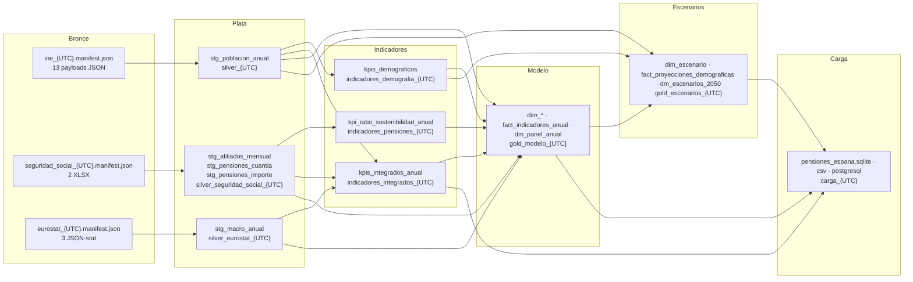

# 8. Linaje de datos (data lineage)

El linaje se puede reconstruir **en tres niveles**, desde cualquier valor de Oro hasta los bytes descargados:

1. **Por fila.** `fact_indicadores_anual.dataset_origen`, `run_id_origen`, `metodologia` y `gold_run_id`. En `kpis_integrados_anual` también `run_ids_origen`, `numerador` y `denominador`.
2. **Por conjunto.** Cada manifiesto (`*.manifest.json`) registra sus entradas con `run_id`, nombre del manifiesto, ruta relativa y **sha256**, y sus salidas con sha256, tamaño y filas. Las lecturas verifican el sha256: un artefacto alterado detiene el pipeline (lo prueba `test_tampered_gold_parquet_is_not_loaded`).
3. **Por ejecución.** `logs/ejecuciones/pipeline_{UTC}.json` enlaza el `run_id` de cada uno de los 13 pasos, con su duración y resultado. La tabla `aux_linaje` de la base publica el linaje de los 12 conjuntos cargados, incluidos los `bronze_run_ids`.

## 8.1 Linaje entre conjuntos

## 8.2 Linaje por KPI

| KPI | Bronce (payload) | Plata | Indicadores | Modelo / escenarios | Controles en el camino |
| --- | --- | --- | --- | --- | --- |
| KPI-01/02/03, % 65+ | `56934_detalle`, `56934_total_edad`, `56934_semiintervalos_edad`; `36643_*`, `36652_*` | `stg_poblacion_anual` (`metrica = poblacion`) | `kpis_demograficos` | `fact_indicadores_anual`, `fact_proyecciones_demograficas` | Detalle igual a «Todas las edades» (SLV-005); tramo homologado (SLV-003); grupos que suman el total (GLD-002); fórmula recalculada (MOD-14, ESC-09) |
| KPI-04 | `1407_detalle` | `stg_poblacion_anual` (`indicador_coyuntural_fecundidad`) | — (publicado) | `fact_indicadores_anual` | Constantes estrictas; rango [0,5, 5] |
| KPI-05 | `6566_detalle` | `stg_poblacion_anual` (nacimientos, defunciones; copias duplicadas eliminadas) | `kpis_demograficos` | `fact_indicadores_anual` | Eventos completos (GLD-005); saldo = componentes (MOD-14) |
| KPI-06 | `24309_detalle` (≤ 2020), `69758_detalle` (≥ 2021) | `stg_poblacion_anual` | — (publicado) | `fact_indicadores_anual` | Unidad homogénea por metodología (MOD-13) |
| KPI-07 | `afiliados_alta_*.xlsx`, `pensionistas_nomina_*.xlsx` | `stg_afiliados_mensual`, `stg_pensiones_cuantia` | `kpi_ratio_sostenibilidad_anual` | `fact_indicadores_anual` | Clases que suman el total; anual igual al mensual de diciembre; metodología homogénea; ratio = componentes |
| KPI-08 | `gasto_pensiones_*.json`, `pib_*.json` | `stg_macro_anual` | `kpis_integrados_anual` | `fact_indicadores_anual`, `aux_kpis_integrados` | Flags documentados; coherencia del cálculo; contraste con el % publicado (≤ 0,005 pp) |

## 8.3 Ejemplo de trazabilidad inversa (ejecución del 29/09/2026)

Valor: `gasto_pensiones_pib` de 2024 = 13,2266 % en `fact_indicadores_anual`.

1. **Fila del hecho.** `dataset_origen = kpis_integrados_anual`, `run_id_origen = indicadores_integrados_20260929T…Z`, `estado_dato = provisional`.
2. **Indicador integrado.**
   - `kpis_integrados_anual` guarda `numerador = 210 875,25` (millones de €, gasto) y `denominador = 1 594 330` (millones de €, PIB, provisional).
   - También guarda `valor_publicado = 13,23` y `diferencia_publicado = −0,0034`.
   - `run_ids_origen` apunta a `silver_eurostat_20260929T…Z`.
3. **Plata.** El manifiesto de `stg_macro_anual` apunta a los payloads de Bronce `gasto_pensiones_…json` y `pib_…json`, con su sha256 y `source_updated` (versión de Eurostat del 28/09 y del 29/09/2026).
4. **Bronce.** El manifiesto `eurostat_20260929T…Z.manifest.json` guarda la URL exacta con los filtros, el código HTTP y el sha256 de los bytes originales.
