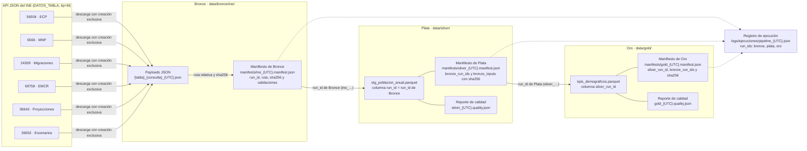

# Diccionario de datos demográficos (INE)

Este documento describe los datos demográficos que el pipeline obtiene del
Instituto Nacional de Estadística (INE) y publica en las capas Plata y Oro.
Incluye las fuentes, las columnas, las métricas y KPIs, el linaje entre capas y
las decisiones y limitaciones que condicionan su interpretación.

- Plata: `data/silver/stg_poblacion_anual.parquet`, con su esquema definido en
  `DemografiaSchema` (`src/transform/demografia_schema.py`).
- Oro: `data/gold/kpis_demograficos.parquet`, con su esquema definido en
  `KpiSchema` (`src/transform/kpi_schema.py`).
- Configuración de fuentes, mapeos y tolerancias: `config/config.yaml`
  (secciones `sources.ine`, `silver` y `gold`).

La prueba `tests/test_diccionario_datos.py` falla si alguna columna de
`DemografiaSchema` o `KpiSchema`, o alguna métrica o KPI, no aparece aquí.

## 1. Catálogo de fuentes INE

Todas las tablas se consultan en la API JSON del INE
(`https://servicios.ine.es/wstempus/js/ES/DATOS_TABLA/{tabla}`) con `tip=M`,
para que cada serie traiga su `MetaData`. Los filtros `tv` se resuelven a partir
de los metadatos (`GRUPOS_TABLA`, `VALORES_GRUPOSTABLA` y `VARIABLE`). Todas
las tablas son de ámbito nacional (España).

| ID | Tabla | Operación | Variables (FK_Variable) | Unidad (FK_Unidad) | Frecuencia | Estado | Cobertura | Consultas |
| --- | --- | --- | --- | --- | --- | --- | --- | --- |
| 56934 | Población residente por fecha, sexo y edad (desde 1971) | Estadística Continua de Población (ECP) | Sexo (18), edad simple (355), total de edad (356), tramo abierto de edad (357), territorio (349), concepto (260: Población), tipo de dato (3: Número) | Personas (3) | Semestral (1 de enero y 1 de julio) y trimestral en los años recientes; Plata usa solo el 1 de enero | Observado | 1971–2025 | `detalle`: 3 sexos × 105 edades simples (0–104) + `105 y más años`; `total_edad`: `Todas las edades`; `semiintervalos_edad`: `85 y más años` y `100 y más años` |
| 6566 | Fenómenos demográficos por tipo de fenómeno demográfico | Movimiento Natural de la Población (MNP) | Concepto (260: Nacimiento, Defunción), territorio (349), tipo de dato (3: Dato base) | Nacimientos (120), Defunciones (122) | Anual (año natural) | Observado | 1992–2024 | `detalle`: Nacimiento y Defunción (series MNP17544 y MNP17542) |
| 24309 | Saldo migratorio con el extranjero por año, nacionalidad y país de nacimiento | Estadística de Migraciones | Nacionalidad (141: Total), país de nacimiento (431: Total), concepto (260: Saldo con el extranjero), territorio (349) | Movimientos migratorios (155) | Anual | Observado | 2008–2021 (Plata usa 2008–2020) | `detalle`: total de nacionalidades y países de nacimiento |
| 69758 | Saldos por año, sexo, nacionalidad y tipo de saldo | Estadística de Migraciones y Cambios de Residencia (EMCR) | Nacionalidad (141: Total), sexo (18: Ambos sexos), tipo de saldo (876: Saldo exterior), tipo de dato (3: Dato base) | Migraciones (420) | Anual | Observado | 2021–2024 | `detalle`: saldo exterior, total de nacionalidades y ambos sexos |
| 36643 | Población residente en España a 1 de enero, por sexo, edad y año | Proyecciones de Población, edición 2026–2076 | Sexo (18), edad simple (355), total de edad (356), tramo abierto de edad (357), territorio (349), concepto (260: Población), tipo de dato (3: Proyección a largo plazo) | Personas (3) | Anual a 1 de enero | Proyectado (escenario central) | 2026–2076 | `detalle`: 3 sexos × 100 edades simples (0–99) + `100 y más años`; `total_edad`: `Todas las edades` |
| 36652 | Análisis de sensibilidad: población residente en España a 1 de enero según escenario, por sexo, edad y año | Proyecciones de Población, edición 2026–2076 | Escenario (876: 8 escenarios), sexo (18), edad simple (355), total de edad (356), tramo abierto de edad (357), territorio (349), concepto (260: Población), tipo de dato (3: Proyección a largo plazo) | Personas (3) | Anual a 1 de enero | Proyectado | 2026–2076 | `detalle`: 8 escenarios × 3 sexos × 101 edades (0–99 y `100 y más años`); `total_edad`: `Todas las edades` por escenario y sexo |

## 2. Diccionario de columnas de Plata (`stg_poblacion_anual`)

Formato largo: una fila por observación, con el grano periodo × territorio ×
sexo × edad × métrica × fuente × estado × escenario.

| Columna | Tipo | Nulos | Dominio | Definición |
| --- | --- | --- | --- | --- |
| `fuente` | string | No | `Instituto Nacional de Estadística` | Organismo que publica el dato (`sources.ine.name`). |
| `tabla_id` | string | No | 56934, 6566, 24309, 69758, 36643, 36652 | Identificador de la tabla INE de origen. |
| `consulta` | string | No | `detalle`, `total_edad`, `semiintervalos_edad` | Consulta de Bronce de la que procede la fila. |
| `run_id` | string | No | `ine_{UTC}` | `run_id` de la ejecución de Bronce del payload de origen; enlaza la fila con su manifiesto de Bronce. |
| `codigo_serie` | string | No | Código `COD` del INE (por ejemplo, ECP320 o MNP17544) | Serie INE de la que procede el valor. |
| `fecha_referencia` | date32 | No | Fecha | `Fecha` del INE convertida a fecha en hora de Madrid: 1 de enero para la población y 1 de enero del año del dato para las series anuales. |
| `anyo` | int64 | No | 1971–2076 | Año del dato (`Anyo` del INE); coincide con el año de `fecha_referencia`. |
| `territorio` | string | No | `ES` | España (`Total Nacional`, o implícito en 69758). |
| `sexo` | string | No | `total`, `hombres`, `mujeres` | Sexo de la MetaData; `Total` y `Ambos sexos` pasan a `total`. Es `total` implícito en 6566 y 24309, que no tienen sexo. |
| `edad_min` | int64 | No | 0–105 | Primera edad incluida: la edad simple, el límite inferior del tramo abierto, o 0 en los totales. |
| `edad_max` | Int64 | Sí | 0–104 | Última edad incluida en una edad simple; es nula en tramos abiertos y totales. |
| `edad_etiqueta_original` | string | No | Etiqueta INE (`0 años`, `1 año`, `100 y más años`, `Todas las edades`) | Etiqueta de edad publicada. Es `Todas las edades` implícita en las tablas sin edad. |
| `tipo_edad` | string | No | `simple`, `tramo_abierto`, `total` | Tipo de edad según la variable INE: 355, 357 o 356. |
| `metrica` | string | No | `poblacion`, `nacimientos`, `defunciones`, `saldo_migratorio_exterior` | Magnitud medida; se define en la sección 4. |
| `valor` | float64 | Sí en el esquema, rechazado por la regla `valores_no_nulos` | Número real | Valor publicado por el INE. Las proyecciones tienen decimales. |
| `unidad` | string | No | `personas`, `nacimientos`, `defunciones`, `movimientos_migratorios`, `migraciones` | Unidad original de la serie (`FK_Unidad`). |
| `estado_dato` | string | No | `observado`, `provisional`, `proyectado` | Estado del dato, tomado de `data_state` de cada tabla. |
| `escenario` | string | No | `observado`, `central`, `fecundidad_alta`, `fecundidad_baja`, `saldo_migratorio_alto`, `saldo_migratorio_bajo`, `fecundidad_y_saldo_migratorio_altos`, `fecundidad_y_saldo_migratorio_bajos`, `saldo_migratorio_nulo` | `observado` en los datos observados; `central` en 36643; escenario de la MetaData en 36652, sin Central. |
| `es_control` | bool | No | `True`, `False` | `True` en los totales y tramos que no forman parte de la partición de detalle (no se suman); `False` en el detalle. |

## 3. Diccionario de columnas de Oro (`kpis_demograficos`)

Formato largo con el grano año × territorio × escenario × KPI. Solo se
calculan con filas de Plata con `sexo = total` y `es_control = False`.

| Columna | Tipo | Nulos | Dominio | Definición |
| --- | --- | --- | --- | --- |
| `anyo` | int64 | No | 1971–2076 | Año del indicador. |
| `fecha_referencia` | date32 | No | Fecha | 1 de enero del año: fecha de la población, o del año de los eventos en el saldo vegetativo. |
| `territorio` | string | No | `ES` | España. |
| `fuente` | string | No | `Instituto Nacional de Estadística` | Organismo de las series de origen. |
| `estado_dato` | string | No | `observado`, `proyectado` (el esquema admite también `provisional`) | Estado de las series de origen. |
| `escenario` | string | No | Mismo dominio que `escenario` en Plata; `central` procede solo de 36643 | Escenario de proyección, o `observado`. |
| `escenario_kr` | string | No | `observado`, `base`, `optimista`, `pesimista`, `sensibilidad` | Escenario del KR 3.1 (sección 6). |
| `indicador` | string | No | `indice_envejecimiento`, `tasa_dependencia`, `tasa_dependencia_mayores`, `saldo_vegetativo` | KPI calculado; se define en la sección 4. |
| `valor` | float64 | Sí en el esquema, rechazado por la regla `valores_no_nulos` | Número real | Valor del KPI, sin redondear. |
| `unidad` | string | No | `porcentaje`, `personas` | Unidad del KPI. |
| `silver_run_id` | string | No | `silver_{UTC}` | Ejecución de Plata consumida; enlaza con su manifiesto de Plata. |
| `fecha_generacion` | timestamp (µs, UTC) | No | Fecha y hora | Momento en que se generó la ejecución de Oro. |

## 4. Diccionario de métricas y KPIs

Grupos de edad de Oro, por rango numérico y sin leer etiquetas
(`gold.age_groups`):

- menores de 16: `edad_max ≤ 15`;
- de 16 a 64: `edad_min ≥ 16` y `edad_max ≤ 64`;
- 65 o más: `edad_min ≥ 65`, tramos abiertos incluidos.

| Métrica o KPI | Capa | Fórmula | Frecuencia | Unidad | Fuente | Nivel de agregación | Regla de calidad |
| --- | --- | --- | --- | --- | --- | --- | --- |
| `poblacion` | Plata | Población residente publicada por edad y sexo. Detalle: edades simples con dato + tramo abierto vigente, homologado a `100 y más años` desde 1981 | Anual a 1 de enero | personas | INE 56934 (ECP, observado 1971–2025), 36643 y 36652 (Proyecciones 2026–2076) | España × año × sexo × edad simple o tramo × escenario | Detalle = `Todas las edades` (≤ 16 personas en 56934 antes del 1/7/2012; 0 en el resto); no negativa; clave única; tramo homologado = suma de componentes |
| `nacimientos` | Plata | Nacimientos publicados (concepto Nacimiento, serie MNP17544) | Anual (año natural) | nacimientos | INE 6566 (MNP), 1992–2024 | España × año | No negativo; solo se eliminan copias idénticas; clave única |
| `defunciones` | Plata | Defunciones publicadas (concepto Defunción, serie MNP17542) | Anual (año natural) | defunciones | INE 6566 (MNP), 1992–2024 | España × año | No negativo; solo se eliminan copias idénticas; clave única |
| `saldo_migratorio_exterior` | Plata | Saldo con el extranjero publicado: inmigraciones − emigraciones exteriores. Se toma de 24309 hasta 2020 y de 69758 desde 2021 | Anual | movimientos_migratorios (24309) o migraciones (69758) | INE 24309 (Estadística de Migraciones, 2008–2020) y 69758 (EMCR, 2021–2024) | España × año | Clave única sin solape en 2021; puede ser negativo; ruptura de serie documentada (sección 6) |
| `indice_envejecimiento` | Oro | población de 65 o más / población menor de 16 × 100 | Anual a 1 de enero | porcentaje | Plata `poblacion` (56934, 36643, 36652) | España × año × escenario | Denominador > 0; los tres grupos suman la población de detalle; toda edad tiene grupo; contraste con IDB 1418 |
| `tasa_dependencia` | Oro | (población menor de 16 + población de 65 o más) / población de 16 a 64 × 100 | Anual a 1 de enero | porcentaje | Plata `poblacion` (56934, 36643, 36652) | España × año × escenario | Denominador > 0; los grupos suman la población de detalle; contraste con IDB 1419 |
| `tasa_dependencia_mayores` | Oro | población de 65 o más / población de 16 a 64 × 100 | Anual a 1 de enero | porcentaje | Plata `poblacion` (56934, 36643, 36652) | España × año × escenario | Denominador > 0; los grupos suman la población de detalle; contraste con IDB 1421 |
| `saldo_vegetativo` | Oro | nacimientos − defunciones | Anual (año natural) | personas | Plata `nacimientos` y `defunciones` (6566) | España × año, solo observado (1992–2024) | Cada año tiene nacimientos y defunciones; solo observado; contraste con MNP17541 |

## 5. Linaje INE

Cada capa registra el `run_id` de la capa anterior, de modo que un KPI se puede
rastrear hasta el payload JSON original. El registro de ejecución del pipeline
enlaza además los tres `run_id` de cada ejecución.

Ejemplo de una ejecución del 26/09/2026:

- Bronce `ine_20260926T145218.144378Z` (10 payloads).
- Plata `silver_20260926T150752.846163Z` (`bronze_run_ids = [ine_20260926T145218.144378Z]`).
- Oro `gold_20260926T150755.636413Z` (`silver_run_id = silver_20260926T150752.846163Z`).
- Registro `pipeline_20260926T150752.611557Z`, que enlaza las tres.

## 6. Decisiones y limitaciones

- **Tope de edad 85+ en 1971–1980.** De 1971 a 1980 el INE publica edades
  simples solo hasta 84 años, así que en esos años el tope es `85 y más años`.
  Desde 1981 se homologa en `100 y más años`, el mismo tope que las
  proyecciones:
    - De 1981 a enero de 2012 se usa directamente el tramo `100 y más años`.
    - Desde julio de 2012 el INE publica edades simples hasta 104 y
      `105 y más años`. Plata usa entonces la serie publicada `100 y más años`
      y deja como control las edades 100–104 y `105 y más años`; su suma
      coincide con el tramo publicado en todos los periodos.
    - Los grupos de 65 o más años son completos en toda la serie, pero antes de
      1981 no existe el detalle de 85 a 99 años.
- **Ruptura de la serie migratoria en 2021.** 24309 (Estadística de
  Migraciones) mide "movimientos migratorios" y 69758 (EMCR) mide
  "migraciones". Coinciden en 2021, donde 69758 es la fuente canónica:
    - Bronce conserva ambos payloads.
    - Plata usa 24309 hasta 2020 y 69758 desde 2021, cada una con su unidad
      original, así que la serie no es homogénea entre 2020 y 2021.
- **Duplicados de 6566.** La API devuelve tres copias idénticas de cada serie
  (MNP17544 y MNP17542) en un orden que varía entre ejecuciones, por lo que su
  sha256 también varía:
    - Bronce las conserva tal como llegan.
    - Plata elimina solo las copias idénticas, sin depender del orden; unas
      copias contradictorias rechazan la ejecución.
- **Edición de proyecciones 2026–2076.** El INE reutiliza los identificadores
  de tabla entre ediciones; 36643 y 36652 se autorizan para la edición
  2026–2076. Los datos observados llegan hasta 2025 y los proyectados empiezan
  en 2026, sin solape.
- **Tolerancia de redondeo.** El detalle debe cuadrar con `Todas las edades`
  con estos límites:
    - 56934 antes del 1 de julio de 2012: ≤ 16 personas por periodo × sexo. Es
      la diferencia máxima observada (1 de julio de 1996, mujeres), con una
      diferencia relativa máxima de 7,9 × 10⁻⁷. En el grano anual a 1 de enero
      el máximo es de 6 personas.
    - 56934 desde esa fecha, 36643 y 36652: 0, con un épsilon de coma flotante
      de 10⁻⁶ porque las proyecciones tienen decimales (diferencia máxima
      observada: 7,45 × 10⁻⁹).
- **Central de 36652 excluido.** El escenario Central de 36652 duplica 36643.
  36643 es la fuente canónica del escenario base y 36652 aporta solo los siete
  escenarios alternativos.
- **Mapeo `escenario_kr` (KR 3.1).**
    - `observado` → observado.
    - `central` → base.
    - `fecundidad_y_saldo_migratorio_altos` → optimista.
    - `fecundidad_y_saldo_migratorio_bajos` → pesimista.
    - `fecundidad_alta`, `fecundidad_baja`, `saldo_migratorio_alto`,
      `saldo_migratorio_bajo` y `saldo_migratorio_nulo` → sensibilidad.
- **Estado y calidad del dato.** `FK_TipoDato` vale 1 en todas las
  observaciones, incluidas las proyecciones, y el INE no publica sus
  etiquetas. Por eso:
    - `estado_dato` sale de `data_state` de cada tabla, y cualquier otro valor
      de `FK_TipoDato` detiene Plata.
    - Un dato marcado como secreto también detiene Plata.
    - Los únicos nulos de la fuente (edades 100–104 entre 2002 y enero de 2012
      en 56934) son edades simples sin dato y se descartan.
- **MetaData y descargas antiguas.** Las dimensiones se identifican por
  `FK_Variable` en la MetaData (`tip=M`), nunca por la posición en `Nombre`.
  La variable 876 significa "Tipo de saldo" en 69758 y "Escenario" en 36652,
  así que su mapeo se declara por tabla. Las descargas de desarrollo sin
  manifiesto están en `data/bronze/ine/_sin_manifiesto/` y no se usan.
- **Validación contra las cifras oficiales del INE.** Los KPIs de 2025 y el
  saldo vegetativo de 2024 coinciden con los publicados (sección 7).

## 7. Validación contra cifras oficiales del INE

Contraste realizado el 26/09/2026 con la API JSON del INE. La ECP no publica
tablas de indicadores de estructura; el INE los publica en los Indicadores
Demográficos Básicos (IDB), con la misma definición y la población de la ECP.

| Indicador | Fuente oficial | Periodo | Publicado | Calculado | Diferencia a 2 decimales |
| --- | --- | --- | --- | --- | --- |
| `indice_envejecimiento` | IDB, tabla 1418, serie IDB53081 (definitivo) | 1/1/2025 | 148,05 | 148,0548 | 0,00 |
| `tasa_dependencia` | IDB, tabla 1419, serie IDB53241 (definitivo) | 1/1/2025 | 53,17 | 53,1680 | 0,00 |
| `tasa_dependencia_mayores` | IDB, tabla 1421, serie IDB53262 (definitivo) | 1/1/2025 | 31,73 | 31,7341 | 0,00 |
| `saldo_vegetativo` | MNP, tabla 6566, concepto "Crecimiento vegetativo", serie MNP17541 (definitivo) | 2024 | −118 113 | −118 113 | 0 |

Las diferencias sin redondear (+0,0048, −0,0020 y +0,0041) se deben solo a que
el INE publica dos decimales.

## 8. Nota interpretativa: escenarios en 2050

En 2050 la tasa de dependencia total es mayor en el escenario optimista
(74,04 %) que en el base (72,56 %), mientras que la dependencia de mayores
(49,85 % frente a 51,81 %) y el índice de envejecimiento (206,05 % frente a
249,57 %) son menores.

La mayor fecundidad del escenario optimista aumenta sobre todo la población
menor de 16 años (8,14 millones frente a 6,56, un 24 % más). La mayor
inmigración también eleva la población de 16 a 64 años (33,65 frente a 31,62
millones, un 6 % más), pero en menor proporción. Como los menores de 16 son
población dependiente, la dependencia total sube aunque la población mayor
pese relativamente menos.

"Optimista" se refiere a la sostenibilidad demográfica a largo plazo, no a una
menor carga de dependencia inmediata.

## 9. Nota de alcance

El saldo migratorio neto como KPI de Oro y el Indicador Coyuntural de
Fecundidad (ICF) figuran en la propuesta, pero no tienen responsable en el
reparto de roles. Persona 1 entrega el saldo migratorio exterior consolidado en
Plata (`metrica = saldo_migratorio_exterior` en `stg_poblacion_anual.parquet`,
con su unidad original y la ruptura de 2021 documentada) para que el equipo
decida quién calcula esos KPIs.
