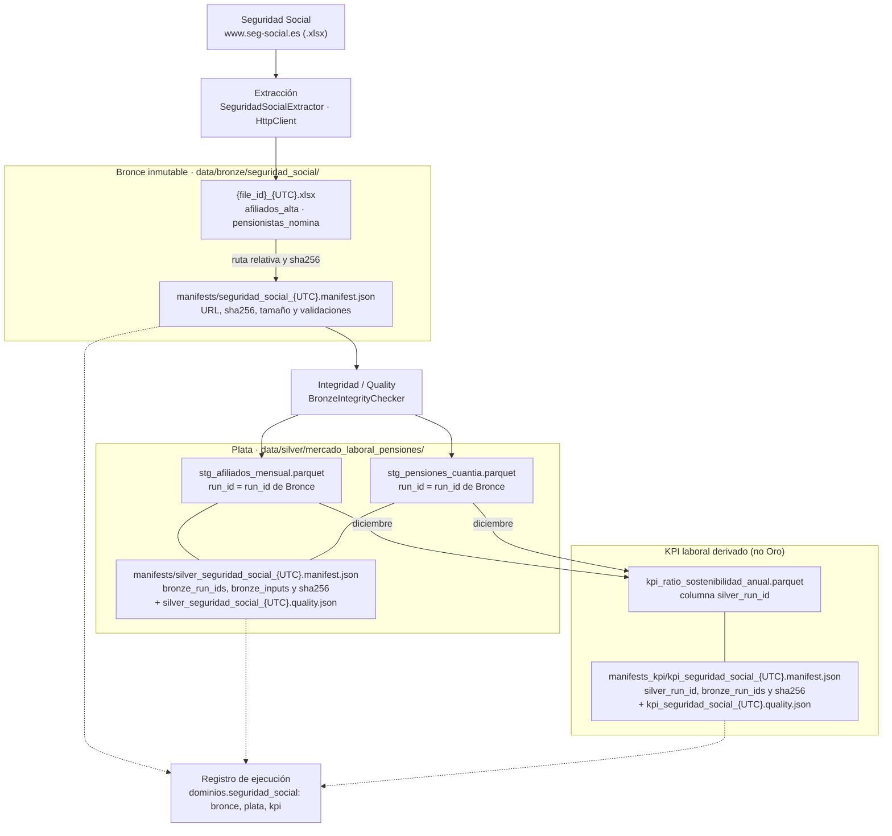

# Diccionario de datos de Seguridad Social (mercado laboral y pensiones)

Este documento describe los datos que el pipeline obtiene de la Seguridad Social
y publica en la capa Plata del dominio laboral. Incluye las fuentes, las
transformaciones, las columnas, las reglas de calidad, la fórmula del ratio
cotizantes/pensionistas, el linaje y las decisiones y limitaciones que
condicionan su interpretación.

- Plata: `data/silver/mercado_laboral_pensiones/stg_afiliados_mensual.parquet`
  (`AfiliadosSchema`) y `stg_pensiones_cuantia.parquet` (`PensionesSchema`),
  definidos en `src/transform/seguridad_social/seguridad_social_schema.py`.
- KPI derivado: `data/silver/mercado_laboral_pensiones/kpi_ratio_sostenibilidad_anual.parquet`
  (`KpiRatioSchema`, `src/transform/seguridad_social/kpi_ratio_schema.py`).
- Configuración: `config/config.yaml`, secciones `sources.seguridad_social`,
  `silver.seguridad_social`, `quality.min_temporal_completeness` y
  `pipeline.domains`.

> **El KPI no es todavía Oro.** `kpi_ratio_sostenibilidad_anual` es un producto
> derivado del dominio laboral que se guarda en Plata.

La prueba `tests/test_diccionario_seguridad_social.py` falla si alguna columna
de los tres esquemas, alguna regla de calidad o el linaje no aparece aquí.

## 1. Catálogo de fuentes

Las URL se configuran en `sources.seguridad_social.files.<archivo>.url`. Ambas
descargan libros Excel `.xlsx` (Office Open XML) de `www.seg-social.es`. Ámbito
nacional (España).

| Archivo (`file_id`) | Publicación | Organismo | Hoja leída | Medida | Fecha de referencia | Frecuencia | Cobertura (descarga de septiembre de 2026) |
| --- | --- | --- | --- | --- | --- | --- | --- |
| `afiliados_alta` | Serie de afiliados en alta por regímenes (último día del mes), 1985–2026 | Tesorería General de la Seguridad Social | `Hoja1` | Afiliados en alta, columna `TOTAL SISTEMA` | Último día de cada mes | Mensual | Enero de 1985 – agosto de 2026 (500 meses, sin huecos) |
| `pensionistas_nomina` | Evolución mensual de las pensiones del sistema (avance mensual) | Instituto Nacional de la Seguridad Social | `Nº Pens. Clases` | Número de **pensiones contributivas** en vigor por clase | Día 1 de cada mes; las filas anuales, a diciembre | Anual (2016–2025) y mensual (enero de 2025 – septiembre de 2026) | 10 filas anuales + 21 mensuales; octubre–diciembre de 2026 aún sin publicar |

Semántica tomada de la propia fuente:

- La hoja de afiliados se titula *Datos totales de afiliados en alta por
  Regímenes (Último Día del mes)*.
- La hoja de pensiones indica *Pensiones en vigor a día 1 de cada mes* y termina
  con la nota **"Datos anuales a diciembre de cada año."**. Es la base para
  asignar el mes 12 a las filas anuales.
- El índice del avance indica **PENSIONES CONTRIBUTIVAS**. Se cuentan pensiones,
  no personas pensionistas: una persona puede cobrar más de una pensión.

## 2. Bronce (`data/bronze/seguridad_social/`)

| Elemento | Ruta | Contenido |
| --- | --- | --- |
| Payload | `data/bronze/seguridad_social/{file_id}_{UTC}.xlsx` | Bytes originales, escritos con creación exclusiva (`BronzeStorage`). No se sobrescriben ni se borran versiones previas. |
| Manifiesto | `data/bronze/seguridad_social/manifests/seguridad_social_{UTC}.manifest.json` | `run_id`, `status`, `files_requested` y, por archivo, URL final, estado HTTP, `content_type`, tamaño, sha256, `downloaded_at_utc`, ruta relativa y validaciones. |
| Sin manifiesto | `data/bronze/seguridad_social/_sin_manifiesto/` | Reservado: Plata nunca lee de aquí. |

`SeguridadSocialExtractor` reutiliza `HttpClient` (timeout, reintentos ante
429/5xx y `Retry-After`), `BronzeStorage` y `RunManifest`. Antes de guardar
valida que la respuesta no esté vacía, que empiece por la firma ZIP de `.xlsx`
(para detectar páginas HTML servidas con HTTP 200), que `openpyxl` pueda abrir
el libro y que exista la hoja configurada. Si una validación falla, no se guarda
nada; si la ejecución falla a medias, se escribe un manifiesto `fallida` con los
archivos ya guardados. `BronzeIntegrityChecker` verifica después que cada payload
esté en exactamente un manifiesto con el mismo tamaño y sha256.

## 3. Transformaciones hacia Plata

`SeguridadSocialBronzeReader` toma la ejecución de Bronce completada más
reciente de cada archivo y lee la hoja como celdas crudas (`header=None`).

- **`AfiliadosParser`** (antes `limpiar_afiliados`):
    - Localiza `Periodo` y `TOTAL SISTEMA` en las primeras filas.
    - Convierte `Mes Año` (con espacios irregulares o abreviaturas como `set`)
      en `anyo`, `mes` y `fecha_referencia` = último día del mes.
    - Ignora notas al pie y filas vacías. Un mes desconocido, un valor no
      numérico o no entero, o la ausencia de encabezados es un error.
    - Conserva toda la serie publicada (desde 1985). No filtra desde 2016: la
      intersección con pensiones se resuelve en el KPI.
- **`PensionesParser`** (antes `limpiar_pensiones`):
    - Lee el bloque entre `PERIODO` y `% de variación anual`. Sustituye el filtro
      anterior `total > 1 000 000`, que solo funcionaba porque los porcentajes
      son pequeños.
    - Arrastra el año a las filas mensuales. Una fila con año y sin mes es
      `tipo_corte = anual`, y recibe el mes 12 **solo si la hoja contiene la nota
      configurada** (`annual_reference.source_note`); si falta, es un error.
    - Las filas con mes y sin valores (meses aún no publicados) no se cargan y
      quedan en la métrica `pensiones_periodos_no_publicados` del reporte de
      calidad.
    - Una columna esperada ausente o una columna no prevista (por ejemplo, una
      nueva clase) es un error. Conserva las cinco clases, no solo jubilación y
      viudedad.
- **`SeguridadSocialTransform`** añade el linaje (`fuente`, `archivo_id`,
  `run_id`), `territorio = ES` y `estado_dato`; tipa con el esquema, ordena,
  evalúa la calidad y, solo si aprueba, escribe ambos Parquet con
  `DatasetWriter` y un único manifiesto de Plata.

## 4. Diccionario de columnas de Plata

### 4.1 `stg_afiliados_mensual`

Grano: **1 fila por territorio × año × mes**. Clave: `territorio`, `anyo`, `mes`.

| Columna | Tipo | Nulos | Dominio | Definición |
| --- | --- | --- | --- | --- |
| `fuente` | string | No | `Seguridad Social` | Organismo de la fuente (`sources.seguridad_social.name`). |
| `archivo_id` | string | No | `afiliados_alta` | Archivo de Bronce de origen. |
| `run_id` | string | No | `seguridad_social_{UTC}` | Ejecución de Bronce del payload; enlaza con su manifiesto. |
| `periodo_original` | string | No | `Enero 2016`, `Febrero 1985`… | Etiqueta publicada, con los espacios normalizados. |
| `fecha_referencia` | date32 | No | Fecha | Último día del mes (la fuente mide el último día). |
| `anyo` | int64 | No | 1985– | Año del dato. |
| `mes` | int64 | No | 1–12 | Mes del dato. |
| `territorio` | string | No | `ES` | España (`silver.seguridad_social.territorio`). |
| `total_afiliados` | Int64 | Sí en el esquema, rechazado por la regla `valores_no_nulos` | Entero > 0 | Afiliados en alta del total del sistema (`TOTAL SISTEMA`). |
| `estado_dato` | string | No | `observado`, `provisional`, `proyectado` | Estado del archivo (`data_state`); hoy es `observado`. |

### 4.2 `stg_pensiones_cuantia`

Grano: **1 fila por territorio × tipo de corte × año × mes**. Clave:
`territorio`, `tipo_corte`, `anyo`, `mes`.

| Columna | Tipo | Nulos | Dominio | Definición |
| --- | --- | --- | --- | --- |
| `fuente` | string | No | `Seguridad Social` | Organismo de la fuente. |
| `archivo_id` | string | No | `pensionistas_nomina` | Archivo de Bronce de origen. |
| `run_id` | string | No | `seguridad_social_{UTC}` | Ejecución de Bronce del payload. |
| `periodo_original` | string | No | `2016`, `2025 Ene`… | Año (filas anuales) o año y mes publicados. |
| `tipo_corte` | string | No | `anual`, `mensual` | `anual`: fila resumen del año, a diciembre según la nota de la fuente. `mensual`: fila de un mes. No se simula ninguna frecuencia. |
| `fecha_referencia` | date32 | No | Fecha | Día 1 del mes (pensiones en vigor a día 1); en las filas anuales, 1 de diciembre. |
| `anyo` | int64 | No | 2016– | Año del dato. |
| `mes` | int64 | No | 1–12 | Mes del dato; 12 en las filas anuales. |
| `territorio` | string | No | `ES` | España. |
| `pensiones_incapacidad_permanente` | Int64 | Sí en el esquema, rechazado por `valores_no_nulos` | Entero ≥ 0 | Pensiones de incapacidad permanente. |
| `pensiones_jubilacion` | Int64 | Sí en el esquema, rechazado por `valores_no_nulos` | Entero ≥ 0 | Pensiones de jubilación. |
| `pensiones_viudedad` | Int64 | Sí en el esquema, rechazado por `valores_no_nulos` | Entero ≥ 0 | Pensiones de viudedad. |
| `pensiones_orfandad` | Int64 | Sí en el esquema, rechazado por `valores_no_nulos` | Entero ≥ 0 | Pensiones de orfandad. |
| `pensiones_favor_familiar` | Int64 | Sí en el esquema, rechazado por `valores_no_nulos` | Entero ≥ 0 | Pensiones en favor de familiares. |
| `total_pensiones` | Int64 | Sí en el esquema, rechazado por `valores_no_nulos` | Entero > 0 | Total de pensiones contributivas (columna `TOTAL`, suma de las cinco clases). |
| `estado_dato` | string | No | `observado`, `provisional`, `proyectado` | Estado del archivo; hoy es `observado`. |

## 5. Diccionario del KPI derivado (`kpi_ratio_sostenibilidad_anual`)

Grano: **1 fila por año × territorio × metodología**. Clave: `anyo`,
`territorio`, `metodologia_ratio`.

| Columna | Tipo | Nulos | Dominio | Definición |
| --- | --- | --- | --- | --- |
| `anyo` | int64 | No | 2016–2025 | Año del ratio. |
| `territorio` | string | No | `ES` | España. |
| `fuente` | string | No | `Seguridad Social` | Organismo de las series de origen. |
| `estado_dato` | string | No | `observado`, `provisional`, `proyectado` | Estado común de numerador y denominador; si difieren, el cálculo se rechaza. |
| `metodologia_ratio` | string | No | `stock_diciembre` | Metodología de anualización (sección 7). |
| `mes_referencia` | int64 | No | 12 | Mes de numerador y denominador. |
| `fecha_referencia_afiliados` | date32 | No | 31 de diciembre | Fecha del stock de afiliados usado. |
| `fecha_referencia_pensiones` | date32 | No | 1 de diciembre | Fecha del stock de pensiones usado. |
| `tipo_corte_pensiones` | string | No | `anual`, `mensual` | Fila de pensiones usada: la anual si existe; si no, la mensual de diciembre (son el mismo dato, verificado por la regla `anual_igual_a_mensual_de_referencia`). |
| `total_afiliados` | int64 | No | Entero > 0 | Numerador. |
| `total_pensiones` | int64 | No | Entero > 0 | Denominador. |
| `ratio_cotizantes_pensionistas` | float64 | Sí en el esquema, rechazado por `valores_no_nulos` | Real > 0 | `total_afiliados / total_pensiones`, sin redondear. |
| `silver_run_id` | string | No | `silver_seguridad_social_{UTC}` | Ejecución de Plata consumida. |
| `fecha_generacion` | timestamp (µs, UTC) | No | Fecha y hora | Momento del cálculo. |

## 6. Reglas de calidad

Cada ejecución escribe `{run_id}.quality.json` junto a su manifiesto, también
cuando falla. Una regla en `falla` bloquea la escritura del Parquet y del
manifiesto. La completitud temporal cuenta los **periodos presentes** dentro de
la cobertura esperada, que va desde `expected_start` hasta el mayor entre
`expected_end` y el último periodo observado. Es distinta de no tener nulos:
exige `>= quality.min_temporal_completeness` (0,95) y lista los periodos
faltantes.

| Conjunto | Regla | Qué valida |
| --- | --- | --- |
| Plata | `integridad_bronce` | Plata solo lee Bronce con la integridad en verde. |
| afiliados y pensiones | `esquema` | Columnas, tipos, nulos obligatorios y dominios; si falla, el resto queda `no_evaluada`. |
| afiliados y pensiones | `valores_no_nulos` | Ningún total ni clase sin valor. |
| afiliados y pensiones | `fraccion_nulos` | Fracción de nulos por columna <= `quality.max_null_percentage`. |
| afiliados | `valores_positivos` | `total_afiliados > 0`. |
| afiliados y pensiones | `mes_valido` | `1 <= mes <= 12`. |
| afiliados y pensiones | `fechas_coherentes` | `anyo` y `mes` coinciden con `fecha_referencia` (último día o día 1 según la fuente), sin fechas futuras. |
| afiliados y pensiones | `clave_unica` | Sin duplicados según el grano. |
| afiliados | `completitud_temporal` | Meses presentes desde `1985-01` >= 95 %. |
| pensiones | `total_positivo` | `total_pensiones > 0`. |
| pensiones | `clases_no_negativas` | Cada clase >= 0. |
| pensiones | `corte_anual_en_mes_de_referencia` | Las filas anuales tienen `mes = annual_reference.month`. |
| pensiones | `clases_no_superan_total` | Jubilación, viudedad y demás clases <= `total_pensiones`. |
| pensiones | `clases_suman_total` | Las cinco clases suman `total_pensiones`; la columna `TOTAL` de la fuente es esa suma. |
| pensiones | `anual_igual_a_mensual_de_referencia` | Si un año tiene fila anual y mensual de diciembre, coinciden (contrasta la nota de la fuente; hoy, 2025). |
| pensiones | `completitud_temporal_anual` | Años 2016–2025 presentes >= 95 %. |
| pensiones | `completitud_temporal_mensual` | Meses desde `2025-01` presentes >= 95 %. |
| KPI | `entrada_plata` | Afiliados y pensiones cumplen su esquema, sin totales nulos, y proceden de la **misma** ejecución de Plata. |
| KPI | `denominadores_positivos` | `total_pensiones > 0`; con denominador 0 el ratio queda nulo (nunca infinito) y se rechaza. |
| KPI | `ratio_positivo` | Ratio > 0. |
| KPI | `ratio_coherente` | Ratio = `total_afiliados / total_pensiones` (tolerancia `float_epsilon`). |
| KPI | `metodologia_homogenea` | Numerador y denominador son del mes 12 del mismo año y hay una sola metodología. |
| KPI | `cobertura_anual` | Años 2016–2025 con ratio >= 95 %. |

El reporte del KPI registra además `anyos_afiliados_sin_pensiones` (hoy
1985–2015) y `anyos_pensiones_sin_afiliados` (años sin pareja, que no se
calculan).

## 7. KPI: fórmula y decisión metodológica

```text
ratio_cotizantes_pensionistas(año) = afiliados en alta a 31/12/año
                                     ─────────────────────────────────────────
                                     pensiones contributivas en vigor a 1/12/año
```

**Frecuencias reales.** Los afiliados tienen una serie mensual completa. Las
pensiones solo tienen para 2016–2024 una observación por año, que la fuente
define como el dato a diciembre; el detalle mensual empieza en 2025.

**Decisión: `stock_diciembre`.** El único corte común a todos los años es
diciembre. Por eso numerador y denominador son siempre el stock de diciembre
del mismo año. No se promedian meses:

- La versión original (`kpi_ratio.py`) cruzaba por mes y después promediaba.
  Con los datos disponibles eso daba diciembre para 2016–2024 y la media de doce
  meses para 2025: dos metodologías distintas en la misma serie.
- La versión del EDA dividía la media anual de afiliados entre las pensiones a
  diciembre, mezclando un flujo medio con un stock puntual.

Consecuencias:

- 2026 no tiene ratio hasta que se publique diciembre de 2026. No se calcula un
  ratio parcial.
- Hay un desfase de 30 días: la fuente de afiliados mide el último día del mes y
  la de pensiones el día 1. Se acepta porque ambos son stocks del mismo mes
  publicado.
- Si algún día hiciera falta otra metodología (por ejemplo,
  `media_mensual_12m`, posible solo desde 2025), se añadiría como nuevo valor de
  `metodologia_ratio`, sin mezclarla en la misma fila ni en la misma clave.

Resultado con la descarga de septiembre de 2026:

| Año | Afiliados (31/12) | Pensiones (1/12) | Ratio |
| --- | --- | --- | --- |
| 2016 | 17 741 897 | 9 473 482 | 1,873 |
| 2017 | 18 331 107 | 9 581 770 | 1,913 |
| 2018 | 18 914 563 | 9 696 272 | 1,951 |
| 2019 | 19 261 636 | 9 801 379 | 1,965 |
| 2020 | 18 904 852 | 9 809 019 | 1,927 |
| 2021 | 19 703 812 | 9 916 966 | 1,987 |
| 2022 | 20 159 317 | 9 994 836 | 2,017 |
| 2023 | 20 733 042 | 10 111 991 | 2,050 |
| 2024 | 21 201 126 | 10 281 477 | 2,062 |
| 2025 | 21 679 951 | 10 434 856 | 2,078 |

## 8. Linaje Seguridad Social

Cada capa registra el `run_id` de la anterior, de modo que un ratio se puede
rastrear hasta el Excel original. El registro de ejecución
`logs/ejecuciones/pipeline_{UTC}.json` añade la clave
`dominios.seguridad_social` con `bronce`, `plata` y `kpi`; la clave `run_ids`
sigue describiendo solo la cadena INE, sin cambios.



Los manifiestos de Plata y del KPI están en carpetas separadas
(`manifests/` y `manifests_kpi/`), y ambas son distintas de
`data/silver/manifests/` del INE. `SilverReader` toma el último manifiesto
completado de su carpeta, así que compartirlas haría que un dominio ocultara
al otro.

## 9. Orquestación

`pipeline.domains` (por defecto, solo `ine` si la clave no existe) decide qué
dominios ejecuta `Pipeline`:

| Etapa inicial | Pasos de Seguridad Social |
| --- | --- |
| `--desde bronce` | `bronce_seguridad_social` → `integridad_bronce_seguridad_social` → `plata_seguridad_social` → `kpi_seguridad_social` |
| `--desde plata` | Reutiliza el último Bronce completado e íntegro, sin descargar: integridad → Plata → KPI |
| `--desde oro` | Solo `kpi_seguridad_social`, sobre la última Plata completada |

Los pasos se intercalan con los del INE (Bronce INE, Bronce SS, integridad y
Plata INE, integridad y Plata SS, Oro INE, KPI SS). Cualquier fallo detiene el
pipeline y deja el registro en `fallida`, como en el INE.

## 10. Decisiones y limitaciones

- **Diciembre por nota de la fuente, no por suposición.** El mes 12 de las
  filas anuales depende de que la hoja contenga *Datos anuales a diciembre de
  cada año.*; si la nota desaparece, Plata se detiene.
- **Pensiones, no pensionistas.** El denominador cuenta pensiones
  contributivas. El nombre `ratio_cotizantes_pensionistas` se conserva por
  continuidad; su lectura correcta es *afiliados en alta por pensión
  contributiva*. No incluye pensiones no contributivas ni clases pasivas.
- **Afiliados, no cotizantes efectivos.** Los afiliados en alta se usan como
  aproximación de cotizantes; incluyen situaciones asimiladas al alta.
- **URL con fecha.** Las URL incluyen el mes de publicación (`1985-agosto+2026`,
  `202609_Avance+mensual`). Cuando la Seguridad Social publique un archivo
  nuevo, la URL anterior puede dejar de responder: el Bronce fallará con un
  error HTTP claro y hay que actualizar `sources.seguridad_social.files.*.url`.
  Mientras tanto, `--desde plata` sigue funcionando con el último Bronce íntegro.
  Las URL solo viven en `config/config.yaml` (ningún módulo Python las contiene)
  y cada una lleva anotado en un comentario el periodo de publicación al que
  corresponde. No se resuelven automáticamente (sin scraping): son endpoints
  que dependen de la publicación oficial.
- **Coberturas mínimas fijadas en la configuración.** `expected_end` es un
  mínimo (agosto y septiembre de 2026); un archivo más reciente también pasa.
  Si se quiere exigir el mes más reciente, hay que actualizarlo.
- **Serie histórica de afiliados.** Los regímenes cambian a lo largo del tiempo
  (notas (1)–(12) de la fuente). Se usa solo `TOTAL SISTEMA`, que es
  homogéneo; el desglose por régimen no se carga.
- **Revisiones del avance.** El avance de pensiones puede revisar meses
  recientes. Cada descarga es un Bronce nuevo y Plata usa la más reciente.
