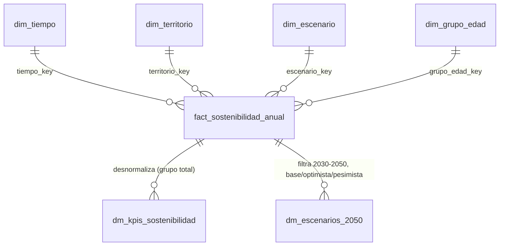

# Modelo dimensional de sostenibilidad (Oro)

Este documento es el contrato de la capa Oro de sostenibilidad: dimensiones,
tabla de hechos y data marts que integran los resultados aprobados del INE y de
la Seguridad Social para analizar el riesgo demográfico y la sostenibilidad del
sistema público de pensiones en España.

- Orquestación: `SostenibilidadGold` (`src/load/sostenibilidad_gold.py`).
- Esquemas: `src/transform/sostenibilidad_schema.py`.
- Construcción: `src/transform/sostenibilidad_dimensiones.py`,
  `src/transform/sostenibilidad_fact.py` y `src/transform/sostenibilidad_marts.py`.
- Calidad: `SostenibilidadQuality` (`src/quality/sostenibilidad_quality.py`).
- Configuración: `config/config.yaml`, sección `gold_sostenibilidad`.

La prueba `tests/test_modelo_dimensional.py` falla si alguna tabla, columna o
indicador del modelo no aparece aquí.

## 1. Objetivo

Ofrecer una única base analítica, anual y trazable, que permita:

1. Seguir la evolución observada del envejecimiento, la dependencia
   demográfica, el crecimiento natural y migratorio, y la relación entre
   afiliados y pensiones contributivas.
2. Comparar los escenarios de proyección de población del INE para 2030–2050.
3. Incorporar más adelante la macroeconomía (PIB, IPC, gasto en pensiones) sin
   rehacer el modelo.

Oro **integra** resultados aprobados; no recalcula KPIs que ya calcula y valida
una capa anterior, ni crea datos que no publique una fuente oficial.

## 2. Fuentes utilizadas

Oro de sostenibilidad lee solo artefactos con manifiesto `completada`,
verificando su `sha256` y tamaño con `SilverReader`. Nunca descarga ni vuelve a
transformar Bronce o Plata.

| Conjunto | Capa | Manifiestos | Qué aporta | Clave lógica |
| --- | --- | --- | --- | --- |
| `kpis_demograficos` | Oro INE | `gold.manifests_path` | `indice_envejecimiento`, `tasa_dependencia`, `tasa_dependencia_mayores`, `saldo_vegetativo` | `anyo`, `territorio`, `escenario`, `indicador` |
| `stg_poblacion_anual` | Plata INE | `silver.manifests_path` | `poblacion` (total y por grupo de edad), `nacimientos`, `defunciones`, `saldo_migratorio_exterior` | `anyo`, `territorio`, `sexo`, edad, `metrica`, `escenario`, `tabla_id` |
| `kpi_ratio_sostenibilidad_anual` | Plata SS (derivado) | `silver.seguridad_social.kpi.manifests_path` | `total_afiliados`, `total_pensiones`, `ratio_cotizantes_pensionistas` (stock de diciembre) | `anyo`, `territorio`, `metodologia_ratio` |

`stg_afiliados_mensual` y `stg_pensiones_cuantia` no se leen directamente: el KPI
laboral ya las integra con la metodología `stock_diciembre` y su propia calidad.
Leerlas de nuevo crearía una segunda versión del mismo KPI.

**Coherencia de linaje.** `kpis_demograficos` debe proceder de la misma
ejecución de Plata que `stg_poblacion_anual` que se lee (`silver_run_id` igual
al `run_id` del manifiesto). Si no, Oro se detiene: KPIs y población saldrían de
versiones distintas de los datos.

### Perfil de las entradas reales (ejecución del 29/09/2026)

| Conjunto | Filas | Años | Escenarios | Territorio | Estado | Nulos | Duplicados |
| --- | --- | --- | --- | --- | --- | --- | --- |
| `stg_poblacion_anual` | 141 680 | 1971–2076 | 9 (`observado` + 8 INE) | `ES` | observado, proyectado | solo `edad_max` (estructural) | 0 |
| `kpis_demograficos` | 1 422 | 1971–2076 | 9; `escenario_kr`: observado, base, optimista, pesimista, sensibilidad | `ES` | observado, proyectado | 0 | 0 en la clave |
| `kpi_ratio_sostenibilidad_anual` | 10 | 2016–2025 | observado | `ES` | observado | 0 | 0 |

## 3. Modelo dimensional

Esquema en estrella con una tabla de hechos **larga** (un indicador por fila) y
cuatro dimensiones conformadas. Los data marts son vistas materializadas y
desnormalizadas de la tabla de hechos.



```text
                      dim_tiempo
                          │
dim_territorio ── fact_sostenibilidad_anual ── dim_escenario
                          │
                    dim_grupo_edad
                          │
          ┌───────────────┴───────────────┐
          ▼                               ▼
 dm_kpis_sostenibilidad           dm_escenarios_2050
```

### 3.1 Decisión: tabla de hechos larga

Se evaluaron dos diseños:

- **A. Tabla ancha** (una columna por indicador). Cada métrica tiene una
  cobertura distinta (población desde 1971, nacimientos desde 1992, migración
  desde 2008, ratio laboral 2016–2025, proyecciones 2026–2076). Una fila por
  año y escenario dejaría la mayoría de las celdas vacías: el ratio laboral
  estaría vacío en 96 de 106 años y en todos los escenarios proyectados. Esos
  nulos no son errores, pero en una tabla ancha no se distinguen de un fallo, y
  añadir el PIB obligaría a cambiar el esquema.
- **B. Tabla larga** (una fila por indicador). Solo existen filas para datos
  publicados, así que no hay nulos artificiales. Cada fila guarda su unidad,
  fuente, estado, metodología y `run_id` de origen, lo que conserva la
  trazabilidad (por ejemplo, `stock_diciembre` en el ratio). Añadir un
  indicador macroeconómico es añadir filas con `dominio = macroeconomia`, sin
  cambiar el esquema.

No se crea `dim_indicador`: el catálogo es pequeño (13
indicadores), vive en `gold_sostenibilidad.indicators` y sus atributos (unidad,
fuente, metodología) varían por fila (el saldo migratorio cambia de unidad y de
operación estadística en 2021). Una dimensión con esos atributos los fijaría y
perdería esa variación.

## 4. Grano, PK y FK

| Tabla | Grano | PK | FK |
| --- | --- | --- | --- |
| `dim_tiempo` | 1 fila por año | `tiempo_key` | — |
| `dim_territorio` | 1 fila por territorio | `territorio_key` | — |
| `dim_grupo_edad` | 1 fila por grupo de edad (incluye `total`) | `grupo_edad_key` | — |
| `dim_escenario` | 1 fila por escenario INE u `observado` | `escenario_key` | — |
| `fact_sostenibilidad_anual` | 1 fila por año × territorio × escenario × grupo de edad × indicador | (`tiempo_key`, `territorio_key`, `escenario_key`, `grupo_edad_key`, `indicador`) | `tiempo_key`, `territorio_key`, `escenario_key`, `grupo_edad_key` |
| `dm_kpis_sostenibilidad` | 1 fila por año × territorio × escenario × indicador (grupo `total`) | (`anyo`, `territorio`, `escenario`, `indicador`) | — (desnormalizado) |
| `dm_escenarios_2050` | 1 fila por año × territorio × escenario KR × grupo de edad × indicador, 2030–2050 | (`anyo`, `territorio`, `escenario_kr`, `grupo_edad`, `indicador`) | — (desnormalizado) |

Las claves sustitutas son enteros deterministas: no dependen del orden de
lectura ni de valores aleatorios, y dos ejecuciones con los mismos datos
producen las mismas claves.

## 5. Dimensiones

Se guardan en `data/gold/dimensiones/`.

### 5.1 `dim_tiempo`

Un año por fila, desde el primer al último año con datos en la tabla de hechos
(hoy 1971–2076), sin huecos.

| Columna | Tipo | Nulos | Definición |
| --- | --- | --- | --- |
| `tiempo_key` | int64 | No | Clave sustituta = año (AAAA). Estable y determinista. |
| `anyo` | int64 | No | Año natural. |
| `decada` | int64 | No | Primer año de la década (`anyo // 10 * 10`). |
| `fecha_inicio` | date32 | No | 1 de enero del año. |
| `fecha_fin` | date32 | No | 31 de diciembre del año. |
| `es_observado` | bool | No | `True` si la tabla de hechos tiene al menos un dato observado ese año. |
| `es_proyeccion` | bool | No | `True` si la tabla de hechos tiene al menos un dato proyectado ese año. |

`es_observado` y `es_proyeccion` salen de los datos, no de una fecha fija. Un año
puede tener ambos a `False` solo si no tiene ningún dato (hoy no ocurre).

### 5.2 `dim_territorio`

| Columna | Tipo | Nulos | Definición |
| --- | --- | --- | --- |
| `territorio_key` | int64 | No | Clave fijada en el catálogo `gold_sostenibilidad.territories`. |
| `codigo_territorio` | string | No | Código usado en Plata y Oro (`ES`). |
| `nombre_territorio` | string | No | Nombre del territorio. |
| `nivel_territorial` | string | No | `nacional`, `comunidad_autonoma` o `provincia`. |

Solo contiene los territorios que aparecen en los datos (hoy `ES`). Un código
presente en los datos y ausente del catálogo detiene Oro, en lugar de inventar un
nombre. Para añadir comunidades autónomas basta ampliar el catálogo con claves
nuevas: las existentes no cambian.

### 5.3 `dim_grupo_edad`

Sigue la convención de `kpis_demograficos` (`gold.age_groups`): menores de 16,
16–64 y 65 y más. **No se usa 15–64 ni 20–64**, que cambiarían los KPIs.

| Columna | Tipo | Nulos | Definición |
| --- | --- | --- | --- |
| `grupo_edad_key` | int64 | No | 0 `total`, 1 `menores_16`, 2 `activos_16_64`, 3 `mayores_65`. |
| `codigo_grupo` | string | No | Código interno; coincide con los grupos de `DemografiaKpis`. |
| `edad_min` | int64 | No | Primera edad incluida. |
| `edad_max` | Int64 | Sí | Última edad incluida; **nula en los grupos abiertos** (`mayores_65` y `total`). |
| `descripcion` | string | No | Texto legible del tramo. |

El grupo `mayores_65` es abierto: incluye el último tramo publicado, que Plata
homologa como `100 y más años` (`silver.ine.homologated_top_age`). `edad_max`
queda nulo en lugar de un límite ficticio. El grupo `total` sirve a los
indicadores que no se desagregan por edad.

### 5.4 `dim_escenario`

Solo contiene los escenarios presentes en `kpis_demograficos`.

| Columna | Tipo | Nulos | Definición |
| --- | --- | --- | --- |
| `escenario_key` | int64 | No | Posición del escenario en `SCENARIOS` (`src/transform/demografia_schema.py`) + 1; `observado` = 1. |
| `codigo_escenario` | string | No | `observado` o escenario INE normalizado en Plata. |
| `escenario_kr` | string | No | Mapeo existente `gold.escenario_kr`: `observado`, `base`, `optimista`, `pesimista`, `sensibilidad`. |
| `estado_dato` | string | No | `observado` u `proyectado`. |
| `etiqueta_ine` | string | Sí | Etiqueta publicada por el INE (`Central`, `Fecundidad alta`…); nula en `observado`. |
| `descripcion` | string | No | Texto legible. |
| `es_escenario_principal` | bool | No | `True` en `observado`, `base`, `optimista` y `pesimista`. |

## 6. Tabla de hechos `fact_sostenibilidad_anual`

Ruta: `data/gold/fact_sostenibilidad_anual.parquet`.

| Columna | Tipo | Nulos | Definición |
| --- | --- | --- | --- |
| `tiempo_key` | int64 | No | FK a `dim_tiempo`. |
| `territorio_key` | int64 | No | FK a `dim_territorio`. |
| `escenario_key` | int64 | No | FK a `dim_escenario`. |
| `grupo_edad_key` | int64 | No | FK a `dim_grupo_edad` (0 `total` si el indicador no se desagrega por edad). |
| `indicador` | string | No | Indicador (sección 6.1). |
| `dominio` | string | No | `demografia`, `laboral` o `macroeconomia` (reservado). |
| `valor` | float64 | No | Valor publicado o integrado; nunca se rellena. |
| `unidad` | string | No | Unidad del indicador en su fuente. |
| `estado_dato` | string | No | `observado`, `provisional` o `proyectado`. |
| `fuente` | string | No | Organismo que publica el dato. |
| `dataset_origen` | string | No | Conjunto del que procede la fila. |
| `metodologia` | string | No | Método o serie de origen (por ejemplo, `stock_diciembre`, `ine_24309`). |
| `run_id_origen` | string | No | `run_id` de la ejecución que produjo el conjunto de origen. |
| `gold_run_id` | string | No | `run_id` de la ejecución de Oro de sostenibilidad. |
| `fecha_generacion` | timestamp UTC | No | Momento de la ejecución de Oro. |

### 6.1 Indicadores integrados

| Indicador | Dominio | Origen | Grupo de edad | Unidad | Metodología | Cobertura real |
| --- | --- | --- | --- | --- | --- | --- |
| `poblacion` | demografia | `stg_poblacion_anual` | total y los tres grupos | personas | `suma_detalle_edades` | 1971–2025 observado; 2026–2076 × 8 escenarios |
| `nacimientos` | demografia | `stg_poblacion_anual` | total | nacimientos | `ine_6566` | 1992–2024 |
| `defunciones` | demografia | `stg_poblacion_anual` | total | defunciones | `ine_6566` | 1992–2024 |
| `saldo_migratorio_exterior` | demografia | `stg_poblacion_anual` | total | movimientos_migratorios / migraciones | `ine_24309` (2008–2020) / `ine_69758` (2021–2024) | 2008–2024 |
| `indice_envejecimiento` | demografia | `kpis_demograficos` | total | porcentaje | `kpis_demograficos` | 1971–2025; 2026–2076 × 8 |
| `tasa_dependencia` | demografia | `kpis_demograficos` | total | porcentaje | `kpis_demograficos` | 1971–2025; 2026–2076 × 8 |
| `tasa_dependencia_mayores` | demografia | `kpis_demograficos` | total | porcentaje | `kpis_demograficos` | 1971–2025; 2026–2076 × 8 |
| `saldo_vegetativo` | demografia | `kpis_demograficos` | total | personas | `kpis_demograficos` | 1992–2024 |
| `total_afiliados` | laboral | `kpi_ratio_sostenibilidad_anual` | total | afiliados | `stock_diciembre` | 2016–2025 |
| `total_pensiones` | laboral | `kpi_ratio_sostenibilidad_anual` | total | pensiones | `stock_diciembre` | 2016–2025 |
| `ratio_cotizantes_pensionistas` | laboral | `kpi_ratio_sostenibilidad_anual` | total | afiliados_por_pension | `stock_diciembre` | 2016–2025 |

- `tasa_dependencia` es la *tasa de dependencia demográfica* (menores de 16 y
  mayores de 65 sobre la población de 16–64); conserva el nombre de
  `kpis_demograficos`.
- `saldo_migratorio_exterior` une dos operaciones del INE con **ruptura de
  serie** en 2021 (tabla 24309 hasta 2020 y 69758 desde 2021, según la
  reconciliación `sources.ine.reconciliation`). La unidad y la metodología de
  cada fila conservan esa diferencia; no se homogeneizan.
- La población por grupo de edad usa `DemografiaKpis.age_groups`, la misma
  clasificación que alimenta los KPIs: no hay una segunda regla de edades.

### 6.2 Lo que la tabla de hechos no contiene

- **Ratio laboral después de 2025**, ni en escenarios proyectados. Diciembre de
  2026 aún no está publicado y no existe una proyección oficial integrada.
- **Macroeconomía** (`pib`, `ipc`, `gasto_pensiones`, `gasto_pensiones_pib`):
  pendiente del dominio macroeconómico (sección 12). No hay columnas ni filas
  con ceros o valores simulados.
- **Interpolaciones**: un año sin dato no tiene fila.

## 7. Data mart `dm_kpis_sostenibilidad`

Ruta: `data/gold/dm_kpis_sostenibilidad.parquet`. Producto de consumo directo:
indicadores de sostenibilidad del grupo `total`, con nombres legibles en lugar
de claves.

| Columna | Tipo | Nulos | Definición |
| --- | --- | --- | --- |
| `anyo` | int64 | No | Año (de `dim_tiempo`). |
| `territorio` | string | No | `codigo_territorio`. |
| `nombre_territorio` | string | No | `nombre_territorio`. |
| `escenario` | string | No | `codigo_escenario`. |
| `escenario_kr` | string | No | `escenario_kr`. |
| `indicador` | string | No | Uno de `gold_sostenibilidad.kpis_mart.indicators`. |
| `dominio` | string | No | `demografia` o `laboral`. |
| `valor` | float64 | No | Valor de la tabla de hechos. |
| `unidad` | string | No | Unidad. |
| `estado_dato` | string | No | Estado. |
| `fuente` | string | No | Organismo publicador. |
| `metodologia` | string | No | Método o serie de origen. |
| `gold_run_id` | string | No | Ejecución de Oro. |

Incluye los años observados y los cinco `escenario_kr` de las proyecciones.
Los indicadores del mart se configuran en
`gold_sostenibilidad.kpis_mart.indicators`.

### 7.1 Indicadores incluidos en `dm_kpis_sostenibilidad`

Seis KPIs analíticos finales (1 449 filas en la ejecución de control):

- `indice_envejecimiento`: mayores de 65 por cada 100 menores de 16
  (1971–2076).
- `tasa_dependencia`: menores de 16 y mayores de 65 por cada 100 personas de
  16–64 años (1971–2076).
- `tasa_dependencia_mayores`: mayores de 65 por cada 100 personas de 16–64
  años (1971–2076).
- `saldo_vegetativo`: crecimiento natural, nacimientos − defunciones
  (1992–2024).
- `saldo_migratorio_exterior`: crecimiento migratorio neto con el extranjero
  (2008–2024, con ruptura de serie en 2021).
- `ratio_cotizantes_pensionistas`: afiliados en alta por pensión contributiva,
  stock de diciembre (2016–2025).

### 7.2 Indicadores que quedan solo en `fact_sostenibilidad_anual`

Cinco métricas base:

- `poblacion` (total y por grupo de edad): numerador y denominador de los
  tres KPIs de estructura.
- `nacimientos` y `defunciones`: componentes de `saldo_vegetativo`.
- `total_afiliados` y `total_pensiones`: numerador y denominador de
  `ratio_cotizantes_pensionistas` (stock de diciembre).

### 7.3 Justificación

El mart ofrece **indicadores finales** que se leen directamente como señales de
riesgo demográfico o de sostenibilidad: tasas y ratios comparables en el
tiempo y entre escenarios, y los dos saldos que explican el crecimiento de la
población (natural y migratorio). Las cinco métricas que quedan en la tabla de
hechos son **variables de soporte**:

- Son los componentes de los KPIs del mart. Publicarlas juntas mezclaría
  magnitudes absolutas (personas, afiliados, pensiones) con tasas en la misma
  columna `valor`, y los consumidores podrían agregarlas o compararlas de forma
  incorrecta.
- Siguen disponibles en la tabla de hechos, con su unidad, su metodología y su
  linaje. Ahí sirven para auditar los KPIs: la regla `fact_coherencia`
  recalcula cada KPI a partir de ellas.
- `poblacion` por grupo de edad sí se usa en `dm_escenarios_2050`, porque el
  volumen proyectado de cada grupo es en sí un resultado de los escenarios.

Los dos saldos entran en el mart aunque sean volúmenes y no tasas. No son
componentes de ningún otro KPI del modelo: son la medida final del crecimiento
natural y del migratorio, dos de los motores del envejecimiento.

No falta ningún KPI definido hoy. `gasto_pensiones_pib` **no se incluye**: queda
como *pendiente de dominio macroeconómico* en el manifiesto
(`indicadores_pendientes`), no como cero. Se añadirá a
`kpis_mart.indicators` cuando exista (sección 15). Sus componentes, `pib` y
`gasto_pensiones`, quedarán solo en la tabla de hechos, igual que las métricas
base actuales.

## 8. Escenarios prospectivos `dm_escenarios_2050`

Ruta: `data/gold/dm_escenarios_2050.parquet`. Compara 2030–2050
(`gold_sostenibilidad.scenarios`) en los escenarios `base`, `optimista` y
`pesimista`.

| Columna | Tipo | Nulos | Definición |
| --- | --- | --- | --- |
| `anyo` | int64 | No | Año, 2030–2050. |
| `territorio` | string | No | `codigo_territorio`. |
| `escenario_kr` | string | No | `base`, `optimista` o `pesimista`. |
| `escenario` | string | No | Escenario INE del que procede. |
| `indicador` | string | No | `poblacion`, `indice_envejecimiento`, `tasa_dependencia`, `tasa_dependencia_mayores`. |
| `grupo_edad` | string | No | `codigo_grupo` (`total` salvo en `poblacion`, que incluye los tres grupos). |
| `valor` | float64 | No | Valor proyectado. |
| `unidad` | string | No | Unidad. |
| `diferencia_vs_base` | float64 | No | `valor − valor del escenario base` para el mismo año, indicador y grupo (0 en `base`). |
| `estado_dato` | string | No | Siempre `proyectado`. |
| `fuente` | string | No | Instituto Nacional de Estadística. |
| `gold_run_id` | string | No | Ejecución de Oro. |

**Qué se proyecta.** Solo métricas derivables de las Proyecciones de Población
del INE 2026–2076 (tablas 36643 y 36652): población total y por grupo de edad,
índice de envejecimiento y tasas de dependencia.

**Mapeo de escenarios** (ya existente en `gold.escenario_kr`):

| `escenario_kr` | Escenario INE | Tabla |
| --- | --- | --- |
| `base` | Central | 36643 |
| `optimista` | Fecundidad y saldo migratorio altos | 36652 |
| `pesimista` | Fecundidad y saldo migratorio bajos | 36652 |

Los cinco escenarios de sensibilidad siguen en la tabla de hechos y en
`dm_kpis_sostenibilidad`, pero no en este mart.

**Qué no se proyecta.** El ratio cotizantes/pensionistas, el empleo, el PIB, el
IPC y el gasto en pensiones. *Optimista* y *pesimista* son escenarios
**demográficos** (más o menos población joven y activa); **no equivalen** a un
escenario fiscal optimista o pesimista, que dependería de productividad, empleo,
revalorización y reformas no modelados aquí. Los datos lo muestran: en 2050 el
escenario optimista tiene **más** `tasa_dependencia` que el base (74,0 % frente a
72,6 %), porque la fecundidad alta añade menores de 16 años, aunque su
`tasa_dependencia_mayores` sea menor (49,8 % frente a 51,8 %).

## 9. Fórmulas

Oro de sostenibilidad no calcula KPIs nuevos. Las fórmulas vienen de las capas
de origen:

```text
indice_envejecimiento     = poblacion(65+) / poblacion(<16) × 100
tasa_dependencia          = (poblacion(<16) + poblacion(65+)) / poblacion(16–64) × 100
tasa_dependencia_mayores  = poblacion(65+) / poblacion(16–64) × 100
saldo_vegetativo          = nacimientos − defunciones
ratio_cotizantes_pensionistas = afiliados en alta a 31/12 / pensiones contributivas a 1/12
poblacion (grupo g)       = Σ población de detalle (sexo total) con edad en g
diferencia_vs_base        = valor(escenario) − valor(base)
```

La calidad **vuelve a comprobar** las tres primeras con la población por grupo,
el saldo vegetativo con nacimientos y defunciones, y el ratio con sus totales.
Es una comprobación de coherencia entre conjuntos, no una segunda versión del
KPI: el valor publicado siempre es el de origen.

## 10. Coberturas esperadas

La cobertura esperada de cada indicador se deriva de la configuración de su
fuente, por estado del dato; no se exige 1971–2076 a todos:

| Indicador | Observado | Proyectado (por escenario) |
| --- | --- | --- |
| `poblacion` y los tres KPIs de estructura | 56934: 1971–2025 | 36643 y 36652: 2026–2076 |
| `nacimientos`, `defunciones`, `saldo_vegetativo` | 6566: 1992–2024 | — |
| `saldo_migratorio_exterior` | 24309 ∪ 69758: 2008–2024 | — |
| `total_afiliados`, `total_pensiones`, `ratio_cotizantes_pensionistas` | `silver.seguridad_social.kpi`: 2016–2025 | — |

Un año fuera de cobertura sin dato no es un fallo de calidad.

## 11. Calidad de datos

`SostenibilidadQuality` usa `QualityEvaluation`, `QualityReport` y `TableSchema`.
El reporte `gold_sostenibilidad_{UTC}.quality.json` se guarda junto al
manifiesto en `gold_sostenibilidad.manifests_path`. Cualquier regla en `falla`
detiene Oro sin escribir tablas; las `advertencia` se registran y no detienen.
El reporte incluye `resumen` (`aprobadas`, `advertencias`, `fallas`,
`no_evaluadas`), y la consola lo muestra así: *Calidad de Oro sostenibilidad
aprobada: 24 reglas aprobadas · 1 advertencia · 0 fallas*.

| Ámbito | Regla | Criterio |
| --- | --- | --- |
| Entradas | `entradas_esquema` | Cada entrada cumple su esquema (`KpiSchema`, `DemografiaSchema`, `KpiRatioSchema`). |
| Entradas | `linaje_coherente` | `kpis_demograficos` procede de la Plata leída. |
| Dimensiones | `dimensiones_esquema` | Columnas, tipos, nulos y dominios de cada dimensión. |
| Dimensiones | `dimensiones_clave_unica` | PK y código natural únicos en cada dimensión. |
| Dimensiones | `tiempo_continuo` | `dim_tiempo` no tiene huecos y cubre todos los años de la tabla de hechos. |
| Dimensiones | `grupos_edad_convencion` | Tramos contiguos desde 0 y coherentes con `gold.age_groups`. |
| Dimensiones | `escenarios_validos` | Escenarios presentes en los datos y `escenario_kr` igual al mapeo existente. |
| Hechos | `fact_esquema` | Columnas, tipos, nulos y dominios. |
| Hechos | `fact_clave_unica` | Sin duplicados en la PK. |
| Hechos | `fact_fk_validas` | Toda FK existe en su dimensión. |
| Hechos | `fact_filas_conservadas` | Cada fila de origen aparece una vez: sin pérdidas ni duplicados. |
| Hechos | `fact_valores_no_negativos` | Población, nacimientos, defunciones, afiliados, pensiones, índices y tasas ≥ 0. |
| Hechos | `fact_denominadores_positivos` | Población < 16 y 16–64 > 0 en los años con KPI; `total_pensiones` > 0. |
| Hechos | `fact_estado_escenario` | `observado` solo en el escenario `observado`; proyectado solo en escenarios INE. |
| Hechos | `fact_sin_laboral_proyectado` | Indicadores laborales solo observados y dentro de su cobertura (sin extensión artificial). |
| Hechos | `fact_unidad_homogenea` | Una unidad por indicador y metodología. |
| Hechos | `fact_coherencia` | KPIs = fórmula aplicada a la población por grupo; saldo = nacimientos − defunciones; ratio = afiliados / pensiones (tolerancia `gold.float_epsilon`, relativa). |
| Completitud | `completitud_vertical` | Fracción de nulos por columna ≤ `quality.max_null_percentage`. |
| Completitud | `completitud_temporal` | Por indicador y escenario, años presentes / esperados ≥ `quality.min_temporal_completeness` (95 %). |
| Atípicos | `atipicos` (advertencia) | Ver 11.1. |
| Marts | `marts_esquema` | Esquema de los dos marts. |
| Marts | `marts_clave_unica` | Sin duplicados en la PK de cada mart. |
| Marts | `mart_kpis_conciliado` | Filas del mart = filas de la tabla de hechos para sus indicadores y el grupo `total`. |
| Marts | `escenarios_rango` | Cada serie de `dm_escenarios_2050` cubre todos los años 2030–2050, solo en base, optimista y pesimista. |
| Marts | `escenarios_solo_demografia` | Sin indicadores laborales ni macroeconómicos en el mart prospectivo. |

### 11.1 Detección de atípicos

Se aplica solo a series **observadas** (las proyecciones son salidas de un modelo
del INE y no se juzgan). Para cada serie indicador × grupo de edad se calculan
las variaciones interanuales `d(t) = valor(t) − valor(t−1)` entre años
consecutivos y su *z-score modificado* (Iglewicz y Hoaglin):

```text
z(t) = 0,6745 × (d(t) − mediana(d)) / MAD(d)
```

Una variación con `|z| > gold_sostenibilidad.outliers.max_modified_zscore`
(3,5) se marca como **advertencia**. El método usa diferencias (no niveles),
así que una tendencia sostenida, como el crecimiento de la población, no se
marca. Usa mediana y MAD, resistentes a los propios atípicos. Si MAD = 0
(más de la mitad de las variaciones son idénticas), se usa la desviación absoluta
media: `z(t) = (d(t) − mediana(d)) / (1,253314 × media|d − mediana(d)|)`. Las
series con menos de `min_points` variaciones, o totalmente constantes, no se
evalúan.

**No se elimina ni se corrige ningún valor.** Los atípicos se registran en el
reporte (`metricas.atipicos`) y en el registro técnico para revisión humana: en
datos oficiales, un salto puede ser real (por ejemplo, las defunciones de 2020)
o una ruptura metodológica (el saldo migratorio en 2021).

## 12. Linaje

```text
Bronce INE ─► Plata stg_poblacion_anual ─► Oro kpis_demograficos ─┐
                        │                                          │
                        └──────────────────────────────────────────┼─► Oro sostenibilidad
Bronce SS ─► Plata stg_afiliados / stg_pensiones ─► kpi_ratio ─────┘   (dim_*, fact, dm_*)
```

El manifiesto `gold_sostenibilidad_{UTC}.manifest.json` registra:

- las tres entradas (`dataset`, manifiesto, ruta relativa, `sha256`, `run_id`);
- las siete salidas (`dataset`, ruta, `sha256`, tamaño, filas);
- `indicadores_integrados` e `indicadores_pendientes`.

Cada fila de la tabla de hechos guarda además `dataset_origen`,
`run_id_origen` y `gold_run_id`. El registro de ejecución del pipeline enlaza el
dominio en `dominios.sostenibilidad` (`entradas` y `oro`).

## 13. Ejecución en el pipeline

El dominio `sostenibilidad` se activa en `pipeline.domains` y exige `ine` y
`seguridad_social`. Su paso `oro_sostenibilidad` se ejecuta al final de la
etapa Oro, después de `oro` (KPIs INE) y de `kpi_seguridad_social`:

- `--desde bronce` y `--desde plata`: se ejecuta tras reconstruir Plata y los
  KPIs.
- `--desde oro`: reconstruye los KPIs y después el modelo de sostenibilidad con
  la última Plata aprobada.

El paso nunca descarga ni transforma Bronce o Plata: solo lee manifiestos
completados.

## 14. Limitaciones

- Solo hay datos nacionales (`ES`).
- El ratio laboral cubre 2016–2025 y mide afiliados por **pensión**
  contributiva, no por pensionista (ver el diccionario de Seguridad Social).
- El saldo migratorio tiene una ruptura de serie en 2021 (dos operaciones
  distintas del INE).
- Los escenarios son solo demográficos; no hay escenarios laborales ni
  fiscales.
- El índice de envejecimiento y las tasas dependen del tramo abierto homologado
  en 100 y más años; los grupos no cambian por ello.

## 15. Cómo incorporar el dominio macroeconómico

Cuando existan `stg_pib_anual`, `stg_ipc_historico` y la serie de gasto en
pensiones en Plata, con manifiesto y calidad propios:

1. Declarar cada indicador en `gold_sostenibilidad.indicators` con
   `dominio: macroeconomia`, su unidad y la tabla o metodología de origen, y
   retirarlo de `indicadores_pendientes`.
2. Añadir la lectura del conjunto en `SostenibilidadGold` (otra entrada con
   `SilverReader`) y una función en `sostenibilidad_fact.py` que lo convierta al
   formato largo. El esquema de la tabla de hechos **no cambia**: `dominio` ya
   admite `macroeconomia`.
3. Calcular `gasto_pensiones_pib = gasto_pensiones / pib × 100` en el dominio
   macroeconómico (o en un KPI aprobado), no en Oro, y añadirlo a
   `kpis_mart.indicators`.
4. Proyecciones fiscales (por ejemplo, AIReF) solo con fuente oficial: entrarían
   como nuevos escenarios en `dim_escenario` con su propio `escenario_kr`, sin
   reutilizar los escenarios demográficos.

## 16. Resultados de la ejecución de control

Ejecución del 29/09/2026 con `--desde bronce`, `--desde plata` y `--desde oro`
(todas completadas). Estas cifras documentan esa ejecución; no son reglas de
calidad.

| Tabla | Filas | Columnas | Cobertura | Calidad |
| --- | --- | --- | --- | --- |
| `dim_tiempo` | 106 | 7 | 1971–2076 (observado 1971–2025, proyectado 2026–2076) | aprobada |
| `dim_territorio` | 1 | 4 | `ES` | aprobada |
| `dim_grupo_edad` | 4 | 5 | total, <16, 16–64, 65+ | aprobada |
| `dim_escenario` | 9 | 7 | observado + 8 escenarios INE | aprobada |
| `fact_sostenibilidad_anual` | 3 387 | 15 | 1971–2076, 11 indicadores | aprobada |
| `dm_kpis_sostenibilidad` | 1 449 | 13 | 1971–2076, 6 indicadores | aprobada |
| `dm_escenarios_2050` | 441 | 12 | 2030–2050 × 3 escenarios × 7 series | aprobada |

- Filas de la tabla de hechos por origen: `kpis_demograficos` 1 422, población
  1 852 (463 años-escenario × 4 grupos), eventos de Plata 83, laborales 30.
- Reglas: 24 `cumple` y 1 `advertencia` (`atipicos`); ninguna `falla`.
- Completitud temporal: 70 series evaluadas, mínimo 100 %. Nulos: 0 % en
  todas las columnas.
- Atípicos (17 advertencias, sin cambios en los datos): defunciones y saldo
  vegetativo en 2020–2021 (COVID-19); afiliados y pensiones en 2020 y
  pensiones en 2024; población de 16–64 años en 2003–2008 (ciclo
  inmigratorio) y 2013–2015 (crisis); tasa de dependencia de mayores en
  2004–2005 y 2014; saldo migratorio en 2022 (ruptura de serie y repunte).
- Las cuatro dimensiones tienen el mismo `sha256` en las tres ejecuciones.
